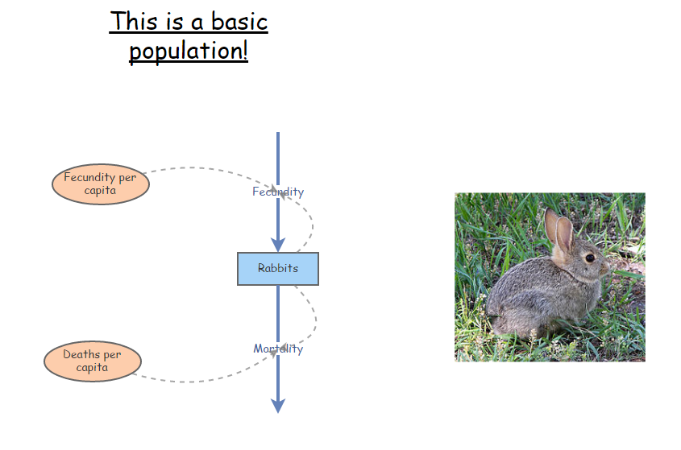
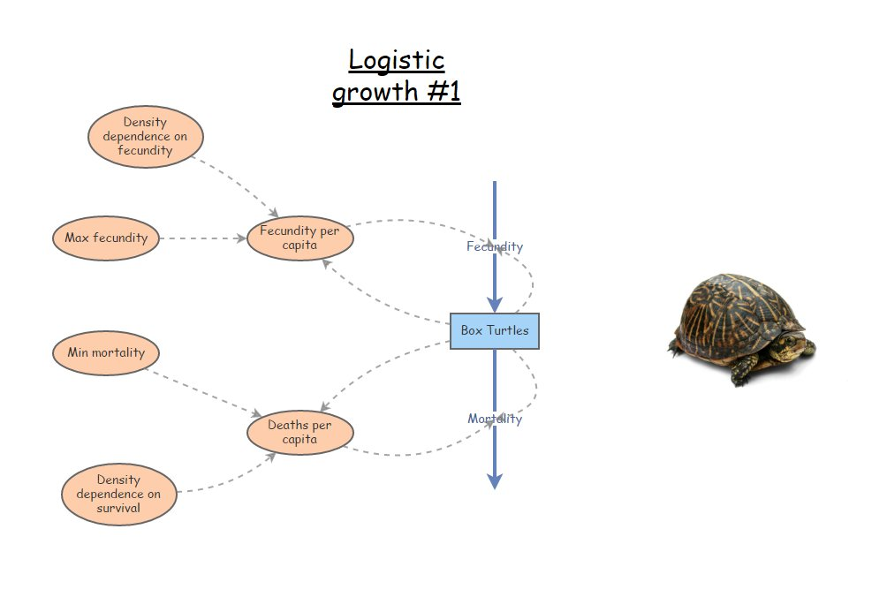

```{r setup, include=FALSE}
knitr::opts_chunk$set(echo = TRUE, cache = TRUE)
```

In this lab we will have an opportunity to build more complex population models in InsightMaker. Among the concepts we will get familiar with are *density dependence*, *chaos* and *time delays*.  

First let's do some math!

## Mathematics of Density-Dependent population regulation

Recall the basic population growth equation:

$\Delta N = (b - d) \cdot N_t \qquad \text{(Eq. 1)}$

Previously we considered *b* and *d* to be constants. 

Now we want them to be functions of abundance! In particular, as abundance goes up, *b* goes down (becomes less favorable):

$b = b_{max}-a*N_t \qquad \text{(Eq. 2)}$

For the death rate *d* we might expect it to go up as abundance goes up (becomes less favorable):

$d = d_{min}+c*N_t \qquad \text{(Eq. 3)}$

The above equations nicely illustrate the meaning of density dependence. That is, one or more vital rates are *dependent* on density!

**Q**: what do the *a* and *c* constants in the above equations really represent? You will have a chance to think more about this in the first exercise. 

Okay, now we can substitute the above equations into **Eq. 1**:

$\Delta N = ((b_{max}-a*N_t) - (d_{min}+c*N_t)) \cdot N_t \qquad \text{(Eq. 4)}$

**Q**: what is the maximum rate of growth in this case? 

Using some tricks of algebra (see the Gotelli book), we can simplify this to:

$\Delta N = r \cdot N_t \left [ 1 - \frac{a+c}{b-d} \cdot N_t  \right ]  \qquad \text{(Eq. 5)}$

Which, if we define $\frac{b-d}{a+c}$ as a constant, $K$, we can re-write like this!

$\Delta N = r \cdot N_t \cdot \left ( 1 - \frac{N}{K}  \right )  \qquad \text{(Eq. 6)}$

This is called the **Logistic population growth equation**. This lab will give us an opportunity to get to know this equation and its implications for population ecology!


## Exercise 1: hypothetical mechanisms of density dependence

Please provide short answers to the following questions:

1a. Tell a plausible story about two (possibly hypothetical) wildlife populations, one of which experiences *lower survival* (higher mortality) as densities increase and another that experiences *lower reproduction*. In 2-3 sentences (for each of your two hypothetical populations), describe the mechanism(s) underlying the reduction in vital rates for your hypothetical populations. Be creative- we will not grade these on whether these mechanisms actually occur in nature- we just want to give you a chance to think about the many possible mechanisms that could potentially regulate wild populations. You can use real-world examples if you would rather- that is up to you.   

1b. For _one of the above mechanisms_, draw (electronically-see below for an easy way to do this) two graphs to illustrate how this hypothetical mechanism might manifest at a population level:         

  i. Abundance (Y axis) over time (X axis). Initialize the abundance well below carrying capacity.      
  ii. Vital rate (*b* or *d*) (Y axis) over abundance (X axis).      
  
For each graph, provide a short (1-2 sentences) description of why you think your hypothetical D-D mechanism would result in this relationship!  

NOTE: you can use a web app like ["A web whiteboard"](https://awwapp.com/) to quickly and easily make and save sketches! I encourage you to use this method, and to embed your sketches in your WebCampus answer.


## Exercise 2: Determining Peruvian anchovy optimal harvest levels!

Let's use InsightMaker to create a logistic growth model based on the collapse of the Peruvian anchovy fisheries (pages 45-47 in Gotelli).

As you develop the logistic growth model for the Peruvian anchovy stock in InsightMaker, you might want to refer to the in-class example for [the logistic growth lecture](LECTURE4.html).

**The Goal**: find the rate of harvest that maximizes the total harvest yield while maintaining a sustainable population!

1.   In InsightMaker, open your basic exponential growth model (with explicit terms for birth and death rates, like you did in lab 1) and choose "Clone Insight" in the upper right corner to create a new copy that you can edit for this exercise. It should look something like this (see below; except for anchovies, not rabbits!). Note that it is not strictly necessary to have [Links] going from [Stocks] (e.g., *Population*) to connected [Flows] (e.g., *Total Births* and *Total Deaths*; InsightMaker assumes that flows may depend on the stocks they connect to). But it makes your models more visually explicit- now you know which parts of the system are interacting and what feedback mechanisms are occurring!)



2.  Now add the density-dependence components! Remember, the density-dependent birth and death rates in the logistic growth model can be expressed as the following: 

$b = b_{max} - aN$, aka density-dependent birth rate = most favorable (maximum) birth rate - (strength of density dependence * N)

$d = d_{min} + cN$, aka density-dependent death rate = most favorable (minimum) death rate + (strength of density dependence * N) 

Rename your per-capita population vital rates: birth rate should be renamed *Max Birth Rate* (maximum birth rate) and death rate should be renamed *Min Death Rate* (minimum death rate).

The density-dependence terms $a$ and $c$ should be modeled in InsightMaker as [Variables] (Click on **Add Primitive** >> **Add Variable**). Make sure the **Links** button is activated, and click and drag your mouse to create links from the new variables to the appropriate per-capita vital rates. Your final model should look something like this (except for anchovies, not box turtles!):



Here we visualize these relationships in R!


```{r eval=TRUE, echo=TRUE}

Density <- seq(0,15000,10)  # create a sequence of numbers from 0 to 500, representing a range of population densities

## CONSTANTS

b_max <- 1   # maximum reproduction (at low densities)
d_min <- 0.4  # minimum mortality (at low densities)

a <- 0.00005    # D-D terms
c <- 0.00001

b <- b_max - a*Density
d <- d_min + c*Density

plot(Density,b,type="l",col="green",lwd=2,ylim=c(0,2),main="Density-Dependence!",xlim=c(0,15000),ylab="Vital rate (b or d)")
points(Density,d,type="l",col="red",lwd=2)
legend("topleft",col=c("green","red"),lty=c(1,1),legend=c("per-capita birth rate","per-capita mortality"),bty="n")

  

```

4.  Next, you'll need to update the equations to calculate the per-capita birth and death rates. Click on the **=** sign in the corner of each variable, and enter the appropriate equations for the appropriate rates (see above):

5.  Enter starting values for your variables. Let's use 10,000 for the initial *Anchovy Population*, 1 for the *Ideal Birth Rate*, 0.00005 for *Density Dependence* for birth rate, 0.4 for *Ideal Death Rate*, and 0.00001 for *Density Dependence* for death rate.

6.  Use the **Settings** button to change the **Simulation Length** to 24 and the timescale to "Months". Click **Simulate**. You may need to click **Configure** in order to clean up your plot to just show **Time** on the x-axis and **Anchovy Population** on the y-axis. Run the model to see if it is working. _Since the abundance is initialized at carrying capacity (K), abundance should not change over time_. Change the initial abundance to a small number (e.g., 10) temporarily to make sure that you see an "S-shaped" logistic growth curve. Once you have confirmed that you see S-shaped growth, return the initial population size to 10,000. 

7.  Next, let's add an additional source of mortality (right now, we have natural baseline mortality (40% per year) and density-dependent effects). This new source of mortality is commercial fishing! This source of mortality should be a new [Flow Out] from the Anchovy population. For now, let's assume harvest is constant -- that is, a given number are harvested each year, regardless of the size of the population (no feedback!).

8. One last thing before we play around with harvest rates: in the properties menu for the anchovy stock, set the property **Allow Negatives** to "No" (the default is "Yes"). We don't want to harvest the population into negative numbers!!!

9.  Finally, try to find the **maximum sustainable yield (MSY)**. That is, find the maximum harvest rate that results in a sustainable (non-declining) population. To do this, try different rates of harvest- I recommend using increments of 200 at first, then narrowing down to smaller increments. Otherwise you might be here a while!! 


### QUESTIONS, Exercise 2:

2a. What is the (approximate) MSY for this population (here, the maximum number of individuals that can be harvested sustainably each month)?  [HINT: you might want to increase the simulation length to make sure it's really sustainable!]

2b. Does the harvest process change the **carrying capacity** (total number of individuals that can be supported sustainably in this system) for the Peruvian anchovies? Explain your reasoning. 

2c. Does the MSY change if you reduce the initial population size down to 1,000 instead of 10,000? If so, what is the new MSY? 

2d. Does the equilibrium point from your answer for 2a (the equilibrium point for the anchovy system with harvest set to MSY) represent a **stable equilibrium**? That is, does the total anchovy abundance return to the same equilibrium condition even if you alter the initial conditions of the model (i.e., alter the initial abundance by making it lower or higher)? Why? Why not? Include plots from InsightMaker to illustrate. [HINT: set the initial abundance to the equilibrium point at MSY. Then try altering the initial abundance in various ways and try re-running the model]

2e. If you were managing this Peruvian anchovy system, would you recommend that catch limits be set at the MSY you determined in part 2a? Why or why not? (More generally, is the MSY sustainable?). Consider the fact that population vital rates (birth and death rates) in real systems exhibit *stochasticity* (random fluctuations) and that we never know population vital rates (e.g., the intrinsic rate of growth, density dependence parameters) with complete certainty.  

2f. Think back to your Wildlife Ecology and Management course. If you know $K$ and $r$ (intrinsic, or maximum, rate of growth for the population), how can you analytically solve for **Maximum Sustainable Yield** (maximum number of individuals that can be harvested sustainably)? Show your calculations. Does your computed MSY match the MSY you found by trial-and-error? (HINT: $r$ in this case is the difference between the maximum birth rate and the minimum death rate! Also, note that the population should have its highest growth potential at 1/2 of K [e.g., K/2]). 

**NOTE**: remember to copy the URL for your Insight (saved as a Public Insight), insert the URL into WebCampus in the appropriate place. And don't make any more changes to this insight once you have submitted it (clone it if you want to keep making changes)!   

## Exercise 3: basic logistic growth model

For this exercise we will set up a simpler model in InsightMaker- this time, we will replicate **Eq. 6** (above). We will sometimes refer to this as "basic logistic growth, r formulation" to distinguish this from basic logistic growth with explicit birth and death rates. 

1. Starting from a blank canvas, add a [Stock] called *Population*. This population should be initialized at 10 individuals, and the *Allow Negatives* field in the properties window should be set to "No" (doesn't make sense to have negative numbers of individuals in the population). Set *Show Value Slider* to "Yes", and set the *Slider Min* to 0 and *Slider Max* to 1000 (with a slider step of 1). 

2. Make a new [Flow] coming out of *Population*, called *Delta N*. In the properties window, set *Only Positive Rates* to "No". You should now see that the flow has an arrow on both ends. That is, this flow can either represent a [Flow In] or a [Flow Out]. It represents the change in *Population* each time step, which can either be positive or negative! [NOTE: the _tiny white triangle in one of the two arrow heads should be facing **out**_ -- this means that a positive value for the flow will mean an addition to the population and a negative flow will be a subtraction from the population]

3. Make a new [Variable] called *Max growth rate* (also known as $r_{max}$), and set it at 0.1. Make a link from *Max growth rate* to *Delta N*. Set *Show Value Slider* to "Yes", and set the *Slider Min* to 0 and *Slider Max* to 5. 

4. Make a new [Variable] called *Carrying capacity* (also known as $K$), and set it at 500. Make a link from *Carrying Capacity* to *Delta N*.

5. Finally, open the equation editor for *Delta N* and type in the logistic growth equation (**Eq. 6**). 

6. Run the simulation for 100 years (1-year time step) and make sure it behaves as expected- that is, it should exhibit logistic (S-shaped) growth and should level off at carrying capacity. 


### QUESTIONS, Exercise 3:

3a. What happens if you initialize the *Population* at above carrying capacity? Do you still see "S-shaped" (logistic) growth? What if you initialize abundance **at** carrying capacity? Is carrying capacity a **stable equilibrium**? Explain your reasoning (include plots from InsightMaker to illustrate). 

3b. Return the initial abundance to 10. Now start adjusting the value of *Max Growth Rate*. What do you notice as the maximum growth rate increases? Focus on the time series of population abundance over time. Can you identify different major changes in your 'abundance over time' plots as the growth rate increases from 1 to 5? You should be able to identify _at least_ four unique patterns of population dynamics! Describe the patterns and the approximate thresholds at which change-overs occur from one pattern to the next. One of these patterns is known as **Chaos** (yes, that is the technical name)!! Can you figure out which pattern is known as chaos?? Provide four plots -- one that illustrates each of the four unique patterns you identified. 

3c. Can you figure out why the patterns in question 3b emerge? This may be somewhat difficult, but try to come up with an explanation for the differences you observe in population dynamics as the rate of growth (*Max Growth Rate*) changes. 

3d. Can you think of a hypothetical or real-world case where **chaos** could emerge as a result of density-dependent processes? Be creative, and explain your reasoning!

**NOTE**: remember to copy the URL for your Insight, insert the URL in the appropriate place on webcampus. And don't make any more changes to this insight once you have submitted it (clone it if you want to keep making changes)!

## Exercise 4: delayed density-dependence! [extra credit!]

What happens when the effects of resource competition are delayed? In this case, the effects of competition (reduction in fitness) will not manifest immediately- but will emerge later down the road!

Let's build on the previous model...

1. First, add a new [Variable] to the system, called *Delayed Abundance*, which will store an abundance value from a previous time step. Draw a new link from *Population* to *Delayed abundance* and from *Delayed abundance* to *Delta N* (you might need to curve your link arrow so it doesn't overlap with other objects on your canvas). 

2. Add a new [Variable] to the system, called *Time Delay*. Set *Show Value Slider* to "Yes", and set the *Slider Min* to 0 and *Slider Max* to 5, and *Slider Step* to 1. Make a new link from *Time Delay* to *Delayed Abundance*

3. Open the equation window for *Delayed abundance*. This variable will store a previous value of *Abundance*, with the time delay set by *Time Delay*. To do this, use the following syntax (which you can access by clicking on "Delay" in the "Historical functions" menu within the equation editor):

```
Delay([Population], [Time delay], [Population])
```

The second "Population" in this function is there just to help the simulation get started (at time-step zero, there are no previous values of *Population*, so InsightMaker will use the initial value of "Population" instead).

4. Finally, modify the equation for *Delta N* so that *Delayed abundance* (not *Population*) is used in the density-dependent portion of the equation (1-N/K). Your equation should now look something like this:

```
[Population]*[Max growth rate]*(1-[Delayed abundance]/[Carrying Capacity])
```


### QUESTIONS, Exercise 4: [NOTE: these are extra credit]

4a. Run the model with different values for the time delay. How does the system behave with a time delay? Do you see any similarities with exercise 3? 

4b. Parasitoid wasps help to keep many lepidopteran populations in check. The wasps lay their eggs in caterpillars, and the caterpillars end up dying a horrific death as the wasp larva grows. Wasp parasitism on caterpillar populations often results in delayed density-dependence -- which in turn results in oscillations in caterpillar populations. Can you think of why this might be the case? Explain your reasoning. 


## Checklist for Lab 2 completion

Your lab answers and pertinent figures, tables and InsightMaker links (make sure they are public!) should be submitted in the Lab 2 quiz in WebCampus.

***Due Feb. 14 at midnight***

*  Word document with short answers
    +  **Exercise 1**
        -  *Short answer (1a.)*   
        -  *Short answer (1b.)*   
 
    +  **Exercise 2**
        -  *Short answer (2a.)*
        -  *Short answer (2b.)*
        -  *Short answer (2c.)*
        -  *Short answer (2d.)* 
        -  *Short answer (2e.)*
        -  *Short answer (2f.)*
 
    +  **Exercise 3**
        -  *Short answer (3a.)*
        -  *Short answer (3b.)*
        -  *Short answer (3c.)*
        -  *Short answer (3d.)*
        
    +  **Exercise 4** [extra credit]
        -  *Short answer (4a.)*
        -  *Short answer (4b.)*

*  InsightMaker models
    +  **Exercises 2,3 and 4**
        -  Your models should show that you were able to create and specify your models correctly. This should be shared with Kevin and Jason in the appropriate place in the WebCampus quiz.


 


