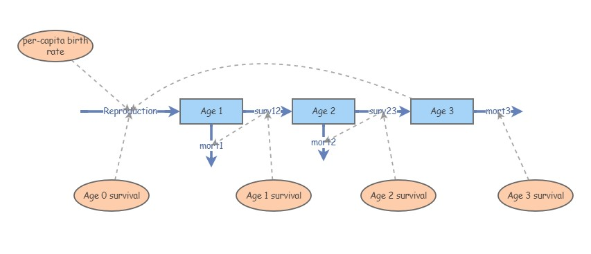

```{r setup, include=FALSE}
knitr::opts_chunk$set(echo = TRUE, cache = TRUE)
```

In this lab we will have an opportunity to build more complex population models in InsightMaker. Among the concepts we will play around with are *age structure*, *life tables*, and *simulating age-structured population dynamics*.  

First let's do some math!

## Mathematics of Age-structured populations

### Life tables

Let's start with some definitions- population ecology, and life tables in particular, are full of terms and equations. We should at least be aware of the meaning of the major terms involved in life table analysis!

**Cohort:** A group of organisms of the same species that are born during the same year or the same breeding season

**x:** Age, or time elapsed since the birth date of the cohort (often in years).       

**S(x):** Survivors, or Census size -- the number of individuals in the study population who survive to time x. 

**D(x):** Deaths -- the number of age x individuals who die before reaching age x+1

**Birth rate, b(x):** Average number of offspring produced by an individual in age category x (per-capita birth rate for individuals of age x).

**Survivorship, l(x):** $l(x) = \frac{S_x}{S_0}  \qquad \text{(Eq. 1)}$ , where $S_x$ is the number of survivors from the original cohort at year $x$. Survivorship represents the fraction of the cohort that is expected to survive to a given age.        

**Survival rate, g(x):** $g(x) = \frac{S_{x+1}}{S_x}  \qquad \text{(Eq. 2)}$ , where $S_x$ is the number of survivors from the original cohort at year $x$ (per-capita survival rate at age x). Survival rate is the probability of survival from age x to age (x+1).

**Lifetime reproductive potential:** $R_0 = \sum_{x=0}^k l(x)\cdot b(x)  \qquad \text{(Eq. 3)}$, where $k$ is the maximum possible age. Lifetime reproductive potential is the average number of female offspring produced per female over her entire lifetime.     

**Life Expectancy (for a newborn)** can be *approximated* as: $LE_0 = \frac{\sum_{x=0}^{k}S(x+1)+0.5*D(x)}{S(0)}  \qquad \text{(Eq. 4)}$     

**Q**: why is the above estimate for life expectancy (LE) *approximate* and not exact? Is it likely to be biased or unbiased?          

**Generation time** is defined as the _Average age of the parents within a cohort_ (for all offspring born to the cohort, first record the age of the mom at the time she gave birth, and then take the average of all these ages!). This can be computed as: $G = \frac{\sum_{x=0}^{k}l(x)\cdot b(x)\cdot x}{\sum_{x=0}^{k}l(x)\cdot b(x)}  \qquad \text{(Eq. 5)}$

**Intrinsic rate of growth,** $r$ is defined (to a first-order approximation) as: $r = \frac{ln(R_0)}{G}  \qquad \text{(Eq. 6)}$

NOTE: the Gotelli book describes a more exact way to compute the intrinsic rate of growth from life tables, called the *Euler method*. You are not required to know how to use the Euler method in this class.      

One more concept I want to introduce here is **reproductive value**, or V(x). This represents the expected future reproductive output of an individual of age x, *adjusted for the intrinsic rate of growth*: $V(x) = \frac{e^{rx}}{l_x} \cdot \sum_{y=x+1}^{k}e^{-ry}l_yb_y   \qquad \text{(Eq. 7)}$.  Different individuals in a population tend to have different "value" in terms of contributing to future generations. Caswell (2001) said "The amount of future reproduction, the probability of surviving to realize it, and the time required for the offspring to be produced all enter into the reproductive value of an age-class". Knowing something about the relative "value" of different individuals in a population can help managers decide which individuals to translocate, or to harvest, or cull from a population. Therefore, reproductive value is critical for applied population ecology! Reproductive Value also factors heavily in evolutionary studies and life history theory.  

**Q:** Why is the reproductive value discounted by the population growth rate??    

## Exercise 1: life table analysis


Let's imagine that we are following a *cohort* of reintroduced Chatham Island robins on a small island through time. 

- First, we establish artificial nests and place 200 captive-laid eggs in them.      
- All individuals are given a unique marking as soon as they hatch (hatching is 100% successful!). These markings are permanent and not affected by tag loss!        
- We visit the island once per year, and count all the female individuals with tags who still exist in the population. We can assume that if the individual is alive then we will observe it (perfect detection!). If we do not see the individual we know with certainty that it is dead!     
- Of the original robins released on the island, we record the following numbers over 5 years revisiting the island (starting with 200 at year 0): 55 (year 1), 25 (year 2), 14 (year 3), 5 (year 4), and 0 (year 5).
- We record the following per-capita reproductive rates for each age: 0, 1.9, 5.8, 5.5, 4.2, and 0        

You can load these data in [this file](life_table2.xlsx). It should look something like this:

```{r include=FALSE}
lifetable <- read.csv("life_table2.csv")
```

```{r results='asis', echo=FALSE}
knitr::kable(lifetable,caption="",col.names = c("x","S(x)","b(x)"))

```

### QUESTIONS, Exercise 1 (black robin example):

1a. Plot the survivorship curve (log-survivorship vs. age). Does this population most closely resemble type I, II, or III survivorship? Include the plot of your survivorship curve in your submitted response. Please refer to the 'age-structured populations' lecture page for more information on survivorship curves. 

1b. What is the lifetime reproductive potential, $R_0$ for this population? Based on your estimate of $R_0$ is this population growing, declining or stable? What would happen to $R_0$ if "age 1" individuals did not reproduce -- that is, what if b(1) were set to zero?  

1c. What is the life expectancy from birth, $LE$, and generation time, $G$ for this population? What would happen to $G$ if "age 1" individuals did not reproduce -- that is, if b(1) were set to zero?  

1d. What is the reproductive value($V$) for each age (x) in this population? Which age is associated with the highest reproductive value? If you wanted to start a new population on a different island, why might you select individuals at this age (that is, the age with highest reproductive value) to translocate?  

1e. Imagine you have the following population of black robins this year: 100 individuals of age 0 (newborns) and 10 individuals of age 1 (no older individuals). How many newborn robins (age 0) would you expect to be born one year from now, assuming no new robins will be born in the population until right before you survey the population next year? Explain how you got your answer! [NOTE: you do not need to use InsightMaker or Excel here- just think it through and use a calculator if needed] [HINT: the age 0 individuals will be 1 years old next year, and the 1-year-olds this year will be two years old next year] [HINT: in order to reproduce next year, individuals must survive to next year!] 

## Exercise 2: another life table analysis


Let's take the Uinta ground squirrel example from the Gotelli book. Take a minute to read the description in Gotelli (end of Ch. 3)... 

This is *real data* from a long-term experimental study. The version you see below is modified from the Gotelli book so it's easier to work with!

The first life table (on the left) represents a cohort of ground squirrels in a population at typical densities.

The second life table (right) represents a cohort of ground squirrels in a population at lower-than-average densities (many conspecifics removed prior to the start of the experiment). 

Load up the [Uinta ground squirrel life table data](life_table3.xlsx) given to us by Gotelli (reproduced from Slade and Balph 1974 -- and modified slightly to make it easier to work with). 

### QUESTIONS, Exercise 2: Uinta ground squirrel example

2a. Compare the two life tables (pre-density reduction and post-density reduction) using the following two major life-table metrics: $R0$ and $r$. What key differences do you notice between these two life tables? If these changes were due to density-dependence, would this represent negative density-dependence (negative feedback) or positive density-dependence (Allee effect)? Explain your reasoning. 

2b. Try altering b(2) in the pre-density-reduction table from 1.29 to 3.5 to reflect a substantial improvement in forage quality. How did generation time ($G$) change after you did this? Based on this result, would you say that $G$ is an intrinsic trait of a species, or can it change as a function of factors like resource availability? Explain your reasoning.   


## Exercise 3: age-structured models in InsightMaker

Let's build an age-structured model from scratch in InsightMaker. To do this, you can follow these steps:

1. Open a blank workspace and save it. 

2. Make three new stocks: *Age 1*, *Age 2* and *Age 3*. 

3. Make a new flow (flow in) called *Births*. This should represent new *Age 1* individuals. We will ignore immigration for now, so new additions into the "Age 1" stock is the only way new individuals can be added to the population. We will assume that *Age 2* and *Age 3* are the only reproductively active ages. Therefore, draw [Links] from *Age 2* and *Age 3* to *Births*. 

4. Make new flows from _Age 1 to Age 2_ and from _Age 2 to Age 3_, called *Transition to Age 2* and *Transition to Age 3*, respectively. These flows represent **growth**, or advancement from *Age 1* to *Age 2* and from *Age 2* to *Age 3*.

5. Make three new flows representing mortality, emerging respectively from each stock and called *Age 1 mortality*, *Age 2 mortality*, and *Age 3 mortality*.  

Your new insight should look something like this (but the flow into Age 1 can be called 'Births' rather than 'Recruitment): 



NOTE: you don't need links from flows to connected stocks (they are already connected so they don't need a link!)- but you are welcome to add these links if it helps you! Also note the flow in to the Age 1 stock should be called "Births", not "Recruitment".  

6. Parameterize your new age-structured population!   

    6a. For births, make new variables called *Birth rate, age 2* and *Birth rate, age 3*, representing the per-capita reproductive rate for age 2 and age 3, respectively. Draw links from these variables to *Births*, and set these variables at 1.3 and 1.6, respectively. Click on the equation editor for *Births* and set the equation appropriately (see questions below)   
    
    6b. For the transitions, make new variables representing the per-capita transition rates, called *Transition rate, Age 1 to 2* and *Transition rate, Age 2 to 3*. Draw links to the appropriate flows, and set these rates at 0.45 and 0.35, respectively. NOTE: these transition rates could also be called "survival rates"                
    6c. For the mortality rates, note that all individuals in the *Age 1* stock must either transition to *Age 2* or die (mortality rates are 1 minus the corresponding transition rate). In addition, all individuals in the *Age 3* stock must die- there is no *Age 4* class! Now click on the equation editors for the mortality rates, and specify the mortality rates appropriately.              

7. For each flow in the model, use the equation editor to specify the appropriate equations. 

8. Explore the model- make sure you understand how it works! 


### QUESTIONS, Exercise 3 (age-structured model in InsightMaker):

3a. What is the equation for *Births* in the above model (flow into the 'Age 1' stock)? Copy and paste your equation from InsightMaker. Using plain English, explain how this equation correctly computes the number of births each year.

3b. Initialize the population abundances (Age 1, Age2, and Age 3 initial abundances) so that the population consists of only 100 individuals in the first (*Age 1*) age class (i.e., 100 individuals in Age 1, no individuals in the other age classes). Run the model for 30 years. Describe how the population dynamics at the beginning of the simulation differs from the dynamics at the end of the simulation. Optionally, you may include an image of an InsightMaker plot to help illustrate your answer.  

3c. Is this a growing or declining population (make sure you use the originally specified vital rates)? Imagine you could enact a predator-control program and reduce the mortality of *Age 1* individuals. How much would you have to reduce mortality (i.e., increase the proportion transitioning from Age 1 to age 2) of this age class to make a growing population? Optionally, you may include an image of an InsightMaker plot to help illustrate your answer.

3d. Please share the URL for your Insight: save your model as a 'Public Insight' and insert the URL into Top Hat in the appropriate place. And don't make any more changes to this insight once you have submitted it (use a 'cloned' version if you want to keep making changes)! 
    

## Optional: exercise 4: more complex age-structured models in InsightMaker!

Implement the following density-dependent model (modifying your previous age-structured model in InsightMaker). _If the total population (all three age classes combined!) exceeds 75 individuals, then reproduction rates drop to 25% of normal rates._ 

4a (optional). Change the Age 2 survival rate to 0.75 (from 0.35). Run the simulation starting with 75 individuals, all in Age class 1. Describe the resulting population dynamics. Is this a **random (stochastic)** model (different results every time you run the model, even with the same initial conditions)? Explain your reasoning. 

4b (optional). Please share the URL for your Insight: save your model as a 'Public Insight' and insert the URL into Top Hat in the appropriate place. And don't make any more changes to this insight once you have submitted it (use a 'cloned' version if you want to keep making changes)! 


## Checklist for Lab 3 completion

* Please type your responses into one Word document and submit _using Top Hat_!

***Due Feb 18 at 11:59pm.***

*  Word document with short answers
    +  **Exercise 1**
        -  *Short answer (1a.)*   
        -  *Short answer (1b.)* 
        -  *Short answer (1c.)*
        -  *Short answer (1d.)*
        -  *Short answer (1e.)*
 
    +  **Exercise 2**
        -  *Short answer (2a.)*
        -  *Short answer (2b.)*
 
    +  **Exercise 3**
        -  *Short answer (3a.)*
        -  *Short answer (3b.)*
        -  *Short answer (3c.)*
        -  *InsightMaker model (3d.)*
        
    +  **Exercise 4 (optional)**
        -  *Short answer (4a.)*
        -  *InsightMaker model (4b.)*


 


