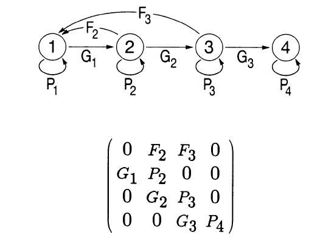

```{r setup, include=FALSE}
knitr::opts_chunk$set(echo = TRUE, cache = TRUE)
```

In this lab we will continue to add complexity (and biological realism) to our population models in InsightMaker. Among the concepts we will play around with are *parameter uncertainty*, *demographic stochasticity* and *environmental stochasticity*.


But first, let's get back to age-structured populations: specifically, **matrix projection models**! Matrix population mod



## Mathematics of matrix population models: 

We all remember the finite-population-growth equation:

$N_{t+1}=\lambda \cdot N_t   \qquad \text{(Eq. 1)}$,

where $N$ is abundance (as always), $t$ is time, often in years but could be any time units, and $\lambda$ is the multipicative growth rate over the time period $t \rightarrow t+1$

The matrix population growth equation looks pretty much the same!

$\mathbf{N}_{t+1} = \mathbf{A} \cdot \mathbf{N}_{t}   \qquad \text{(Eq. 2)}$,

where $\mathbf{N}$ is a **vector** of abundances (abundance for all stages), and $\mathbf{A}$ is the **transition matrix**, which we have seen before.

We can be more explicit about this if we re-write the above equation this way:

$\begin{bmatrix}N_1\\ N_2\\N_3 \end{bmatrix}_{t+1}=\begin{bmatrix}0 & F_2 & F_3\\ P_{1 \rightarrow 2} & P_{2 \rightarrow 2} & 0\\ 0 & P_{2 \rightarrow 3} & P_{3 \rightarrow 3}\end{bmatrix} \cdot \begin{bmatrix}N_1\\ N_2\\N_3 \end{bmatrix}_{t}    \qquad \text{(Eq. 3)}$

Where $P_{1 \rightarrow 2}$ is the probability of advancing from stage 1 to 2, and $F_2$ is the **fecundity** of stage 2.

NOTE: _fecundity is NOT the same thing as birth rate, $b$. What's the difference?

Birth rate, $b_t$, is the _per-capita rate of offspring production_ for stage   

Fecundity, $F_t$, is the _per-capita rate by which an individual of stage $t$ contributes new offspring to the population at time $t+1$. Sounds pretty similar, right? What's the difference??

Fecundity also takes into account the survival rate from $t$ to $t+1$!!  For an adult of stage $t$ to contribute to the next generation, _it must both survive and reproduce_!.

$F_t = P_{1 \rightarrow 2} \cdot  b_{t+1}    \qquad \text{(Eq. 4)}$

### Matrix operations:

There is a lot we can do with matrix population models. The most obvious one is *projection*:

#### Projection:

We have already seen the projection equation (Eq. 2, above). Here is how we can implement this in R:

```{r eval=FALSE}

Year1 <- projection_matrix %*% Abundance_year0  # matrix multiplication!
  
```

Let's try it:

First, build a projection matrix:

```{r}

projection_matrix <- matrix(
  c(
    0,     1.2,   3.1,
    0.4,   0,     0,
    0,     0.75,   0
  )
  ,nrow=3,ncol=3,byrow=T
)

projection_matrix

```

Next, let's build an initial abundance vector:

```{r}
Abundance_year0 <- c(1000,0,0)
Abundance_year0
```

Now we can run the code for real!


```{r}
Year1 <- projection_matrix %*% Abundance_year0  # matrix multiplication!
Year1
```

Now we have 300 individuals in stage 2!

Let's project one more year:

```{r}
Year2 <- projection_matrix %*% Year1  # matrix multiplication!
Year2
```

Finally, here is some code to project many years into the future!

```{r}
nYears <- 20                                            # set the number of years to project
TMat <- projection_matrix                               # define the projection matrix
InitAbund <- Abundance_year0                            # define the initial abundance

  ## NOTE: the code below can be re-used without modification:
allYears <- matrix(0,nrow=nrow(TMat),ncol=nYears+1)     # build a storage array for all abundances!
allYears[,1] <- InitAbund                                      
for(t in 2:(nYears+1)){
  allYears[,t] <-  TMat %*% allYears[,t-1]
}
plot(1,1,pch="",ylim=c(0,max(allYears)),xlim=c(0,nYears+1),xlab="Years",ylab="Abundance",xaxt="n")
cols <- rainbow(3)
for(s in 1:3){
  points(allYears[s,],col=cols[s],type="l",lwd=2)
}
axis(1,at=seq(1,nYears+1),labels = seq(0,nYears))
legend("topleft",col=cols,lwd=rep(2,3),legend=paste("Stage ",seq(1:nrow(TMat))))
```


#### Compute lambda

Clearly this is a growing population. But let's see exactly what $\lambda$ is!

```{r}
library(popbio)

lambda(projection_matrix)
```

Pretty easy right?

#### Compute stable-age distribution (S.A.D.)

Clearly the population doesn't reach a stable age distribution until a few years into our simulation. What exactly is the stable age distribution here?  We can do this in R:

```{r}
stable.stage(projection_matrix)
```

And that is really all we need to know to get started with matrix-based population models!


## Exercise 1: play with matrix projection models!


## Exercise 2: translate InsightMaker to projection matrix!


## Exercise 3: dealing with uncertainty


## Exercise 4: stochastic population models


Are any populations likely to be in stable age distribution in nature?
## Exercise X 

1c) relative role of demographic and environmental stochasticity as populations get bigger
1d) effects of different stochastic probability distributions. 

First let's do some math!


[clone this Insight and construct a matrix population model from this]
[then open R and use matrix multiplication to compute abundance for each stage over the next 10 years]


##Checklist for Lab 4 completion

* Please bundle the materials into one Word document and submit to Professor Shoemaker and Margarete Walden _using WebCampus_!

* Insightmaker models should be shared with your instructors, and the URL for your Insights should be pasted in your lab submission (MS Word document). See details below...  

    * After you save the model you should see a link on the top left-hand corner, "Insight Access". Click on that link, and a new window will pop up. Under "allow update access", add a username (i.e., kevintshoemaker or waldenTA). click on the "Add User" button, and then click on "Submit". Finally, copy and paste the URL into the Word document.

***Due Feb. 24 at 11 am.***

*  Word document with short answers
    +  **Exercise 1**
        -  *Short answer (1a.)*   
        -  *Short answer (1b.)*   
 
    +  **Exercise 2**
        -  *Short answer (2a.)*
        -  *Short answer (2b.)*
        -  *Short answer (2c.)*
        -  *Short answer (2d.)* 
        -  *Short answer (2e.)*
        -  *Short answer (2f.)*
 
    +  **Exercise 3**
        -  *Short answer (3a.)*
        -  *Short answer (3b.)*
        -  *Short answer (3c.)*
        -  *Short answer (3d.)*
        
    +  **Exercise 4**
        -  *Short answer (4a.)*
        -  *Short answer (4b.)*


 


