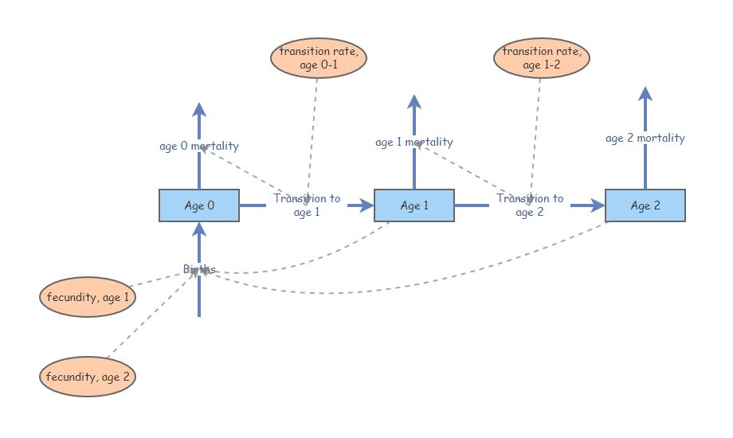

```{r setup, include=FALSE}
knitr::opts_chunk$set(echo = TRUE, cache = TRUE)
```

```{r echo=FALSE}

############################################################
####                                                    ####  
####  NRES 470, Lab 4                                   ####
####                                                    ####
####  Kevin Shoemaker                                   #### 
####  University of Nevada, Reno                        ####
####                                                    #### 
############################################################


############################################################
####  Matrix population models                          ####
############################################################


```

In this lab we will continue to work with age-structured populations: specifically, we will get familiar with **matrix projection models**! Remember that while matrix population models may look complicated, they are just a fancy, age/stage structured version of basic discrete exponential growth ($N_{t+1}=\lambda \cdot N_t$)!

## Mathematics of matrix population models: 

We all remember the finite-population-growth equation:

$N_{t+1}=\lambda \cdot N_t   \qquad \text{(Eq. 1)}$,

where $N$ is abundance (as always), $t$ is time, often in years but could be any time units, and $\lambda$ is the multiplicative growth rate over the time period $t \rightarrow t+1$

In other words, $\lambda$ is the population multiplier per time step. You want next year's expected abundance? Just multiply last year's abundance by $\lambda$!

The matrix population growth equation looks pretty much the same!

$\mathbf{N}_{t+1} = \mathbf{A} \cdot \mathbf{N}_{t}   \qquad \text{(Eq. 2)}$,

where $\mathbf{N}$ is a **vector** of abundances (abundance for all stages), and $\mathbf{A}$ is the **transition matrix**, which we have seen before.

We can be more explicit about this if we re-write the above equation this way:

$\begin{bmatrix}N_1\\ N_2\\N_3 \end{bmatrix}_{t+1}=\begin{bmatrix}F_1 & F_2 & F_3\\ P_{1 \rightarrow 2} & P_{2 \rightarrow 2} & 0\\ 0 & P_{2 \rightarrow 3} & P_{3 \rightarrow 3}\end{bmatrix} \cdot \begin{bmatrix}N_1\\ N_2\\N_3 \end{bmatrix}_{t}    \qquad \text{(Eq. 3)}$

Where $P_{1 \rightarrow 2}$ is the probability of advancing from stage 1 to 2 (per capita 'production' of stage 2 individuals next year by stage 1 individuals this year), and $F_2$ is the **fecundity** of stage 2 (per-capita production of offspring next year by stage 2 individuals this year).

NOTE: _survival *P* in a stage transition matrix is NOT necessarily the same thing as survival rate_ (e.g., g(x) from a life table). What's the difference? 

In a stage-based matrix model, individuals can survive in one of two ways - they can either stay in the same stage, or they can transition to the next stage. To compute total survival, you have to add up the probability of staying in the same stage and the probability of moving on to the next stage! (NOTE: in a **Leslie matrix**, all individuals must either transition to the next stage or die.) 

NOTE: _fecundity *F* in a stage transition matrix is NOT the same thing as age-specific birth rate *b(x)*_ from a life table, $b$. What's the difference?

Birth rate $b_t$ from life tables is the per-capita rate of offspring production for age $t$ individuals (individuals that are exactly age t). We can think of this as the number of offspring produced per female at the moment they reach $t$ years of age.   
Fecundity, $F_s$, is the per-capita rate by which individuals that were in stage $s$ at time $t$ contribute new offspring to the population at time $t+1$. Sounds pretty similar, right? What's the difference?? Well, the difference is exactly *one time step* (which is typically one year)!

That is, Fecundity $F_s$ also takes into account the *survival rate* to the next time step (e.g., $P_{1 \rightarrow 2}$)!! For an adult of stage $s$ to contribute to the next generation, _it must first survive to the next time step_ before it can reproduce!.

$F_s = P_{surv.this.year} \cdot  b_{age.next.year}    \qquad \text{(Eq. 4)}$

### Matrix operations:

There is a lot we can do with matrix population models. The most obvious one is *projection*:

#### Projection:

This lab demo contains a bunch of R code (R makes it pretty easy to run matrix population models!). If you want to follow along in R, you can find the R script [here](LAB4.R). I recommend right-clicking on the link, saving the script to a designated folder, and loading up the script in RStudio.

We have already seen the projection equation (Eq. 2, above). Here is how we can implement this in R:

```{r eval=FALSE}

########
# Syntax for projecting abundance using a transition matrix (NOTE: this code won't run until we specify the terms on the right)

Year1 <- projection_matrix %*% Abundance_year0  # matrix multiplication!
  
```

Let's try it:

First, build a projection matrix:

```{r}

######
# First, build a simple projection matrix

projection_matrix <- matrix(
  c(
    0,     1.2,   3.1,
    0.4,   0,     0,
    0,     0.75,   0
  )
  ,nrow=3,ncol=3,byrow=T
)

projection_matrix

```

Next, let's build an initial abundance vector:

```{r}

######
# Then we specify initial abundances for the three age classes

Abundance_year0 <- c(1000,0,0)
Abundance_year0

```

Now we can run the code for real!


```{r}

######
# Now we can run the code for real

Year1 <- projection_matrix %*% Abundance_year0  # matrix multiplication!
Year1

```

Now we have 300 individuals in stage 2!

Let's project one more year:

```{r}

########
# Project another year

Year2 <- projection_matrix %*% Year1  # matrix multiplication!
Year2

```

Finally, here is some code to project many years into the future! You may want to re-use some of this code for the exercises below. 

```{r}

##########
# Use a FOR loop to project many years into the future

nYears <- 20                                            # set the number of years to project
TMat <- projection_matrix                               # define the projection matrix
InitAbund <- Abundance_year0                            # define the initial abundance

  ## NOTE: the code below can be re-used without modification:
allYears <- matrix(0,nrow=nrow(TMat),ncol=nYears+1)     # build a storage array for all abundances!
allYears[,1] <- InitAbund  # set the year 0 abundance                                    
for(t in 2:(nYears+1)){   # loop through all years
  allYears[,t] <-  TMat %*% allYears[,t-1]
}
plot(1,1,pch="",ylim=c(0,max(allYears)),xlim=c(0,nYears+1),xlab="Years",ylab="Abundance",xaxt="n")  # set up blank plot
cols <- rainbow(ncol(TMat))    # set up colors to use
for(s in 1:ncol(TMat)){
  points(allYears[s,],col=cols[s],type="l",lwd=2)     # plot out each life stage abundance, one at a time
}
axis(1,at=seq(1,nYears+1),labels = seq(0,nYears))   # label the axis
legend("topleft",col=cols,lwd=rep(2,ncol(TMat)),legend=paste("Stage ",seq(1:ncol(TMat))))  # put a legend on the plot

```


#### Compute lambda

Clearly this is a growing population. But let's see exactly what $\lambda$ is!

```{r}

############
# Use the 'popbio' package to compute lambda (NOTE: you first have to install the popbio package! You only have to install the package once...)

library(popbio)

lambda(projection_matrix)

```

Pretty easy right?

NOTE: we are using a "package" in R to make these analyses super easy! So if you don't already have the "popbio" package, go to the "Packages" tab in Rstudio (should be at the top of the lower right panel), click on "Install", and then type "popbio" in the "Packages" field in the pop-up window, then click on the "Install" button. 

Or just use the following code:

```{r eval=FALSE}

#############
# Use this code if you haven't installed 'popbio' yet. Once you've installed it, you can delete the line or comment this line out by adding a pound sign before the "i" in "install.packages"

install.packages("popbio")


```


#### Compute stable-age distribution (S.A.D.)

Clearly the population doesn't reach a stable age distribution until a few years into our simulation. What exactly is the stable age distribution here?  We can do this in R:

```{r}

###### 
# Use the 'popbio' package to compute the stable age distribution!

stable.stage(projection_matrix)

```

And that is really all we need to know to get started with matrix-based population models!


## Exercise 1: matrix projection models!

In this exercise, you will have a chance to play around with a very simple matrix population model. But first, you need to translate a life table into a transition matrix! 

Here is the life table:
    [Excel format](life_table4.xlsx)     
    [CSV format](life_table4.csv)       

```{r echo=FALSE}

lifetable <- read.csv("life_table4.csv")
knitr::kable(lifetable,caption="",col.names = c("x","S(x)","b(x)"))
#lifetable
```

1a. Translate the above *life table* into a five-age-class transition matrix (age class 0 to age class 4). In your written lab report, provide the full transition matrix and describe the formula used to compute the matrix element in row 1 column 3. This is a bit harder than it sounds! Also, it can be difficult to do this as a standard text entry submission, so if you would rather upload an image (e.g., a photo of your hand-drawn matrix and calculations), you can use the optional image upload in Top Hat.

Keep the following points in mind: 

- Individuals are in the "age 0" stage if they are between the ages of 0 and 1. They transition to the "age 1" stage ($P_{0 \rightarrow 1}$) if they survive to age 1 (thereby entering their second year of life).     
- For individuals of the "age 0" class to contribute new offspring to the population in the next time step ($F_0$), they have to survive their first year of life ($P_{0 \rightarrow 1}$) AND produce offspring when they are exactly 1 year of age (which they do at the rate of $b(1)$ -- the birth rate at age 1).    
- Use five age classes for your transition matrix (age class 0 through 4). Individuals in the final age class (age class 4) have zero survival (you can't survive to age 5) and zero fecundity (if there are no individuals left at age 5, how can they reproduce!)      
- No individual ever stays in the same age-class two time steps in a row- they either transition to the next age class or they die (this simple type of matrix model is called a **Leslie Matrix** model).   

NOTE: Gotelli uses the term 'age class 1' to refer to individuals in their first year of life (0-year-olds) and 'age class 2' for individuals in their second year of life (one-year-olds), but I think it's easier to think of this as age class 0, age class 1, etc. That way, our age classes will match the way we usually talk about age in years!  

1b. Use R ('popbio' package) to compute the finite rate of growth for the population ($\lambda$). What is the finite rate of growth $\lambda$ for this population? Based on this result, is this a growing or declining population?   

1c. Use R ('popbio' package) to compute the stable-age distribution for the population (S.A.D.). What is the stable age distribution for this population (fraction of the population in each age-class at S.A.D.)? Now imagine you have a total population size of 850. Assuming this population is at S.A.D., how many individuals are in each age-class? (NOTE: you can't have fractional individuals, so please round to the nearest whole numbers)     

1d. Use R to project this population for 30 years. Initialize your population with 850 individuals, and set the initial population to the stable age distribution you computed in part 1c. What is the total number of individuals in age class 3 (3-year-olds) after 15 years? What is the total abundance (sum across all age classes) after 30 years?

1e. Finally, run your simulation again, this time starting with all 850 individuals in age-class 0 (all newborns!). What is the final abundance after 30 years (sum across all age classes)? Is the final abundance smaller or larger than the final abundance (after 30 years) you computed in part 1d, above? Why do you think the final abundance estimate is different from the calculation you did in question 1d?  


## Exercise 2: translate InsightMaker to projection matrix!

Return to the InsightMaker model you created in Lab 3 (exercise 3 -- that is, a basic age structured population model, without the carrying capacity component you implemented in Exercise 4 of Lab 3). Your model should look something like this:



Make sure the parameters are at the original values specified in Exercise 3 of Lab 3 (before altering mortality rates as part of lab 3 question 3e). As a reminder, here they are again:

- For fecundities, set *Fecundity, age 1* at 1.3 and *Fecundity, age 2* at 1.6.    
- For transition rates, set *Transition rate, Age 0 to 1* at 0.45 and *Transition rate, Age 1 to 2* at 0.35. NOTE: these transition rates could also be called "survival rates"    
- For the mortality rates, note that all individuals in the *Age 0* stock must either transition to *Age 1* or die (mortality rates are 1 minus the corresponding transition rate). In addition, all individuals in the *Age 2* stock must die- there is no *Age 3* class! 

2a. Translate this InsightMaker model into a projection matrix. This shouldn't be too difficult, but pay close attention to the difference between survival (transition to the next stage class) and mortality. Please enter your full transition matrix into TopHat. It can be difficult to do this as a standard text entry submission, so if you would rather upload an image (e.g., a photo of your hand-drawn matrix and calculations), you can use the optional image upload in Top Hat.  

2b. Starting with 75 individuals, all in Age 0, project the population 20 years into the future, using both InsightMaker and R. *You don't need to show your R code or the InsightMaker model this time*. Please provide two plots- one showing the results of the R simulation and the other showing the results of the InsightMaker simulation). These plots should look essentially identical! 

Now let's go the other way around -- build an InsightMaker model based on a population matrix!

#### Use the following stage matrix to answer questions 2c-d

Here is a stage-based matrix to use for building your InsightMaker model:

Click [here](stage_matrix1.csv) to download the CSV file.      
Click [here](stage_matrix1.xlsx) to download the same matrix as an Excel file.   

```{r}
stmat <- read.csv("stage_matrix1.csv")
stmat <- as.matrix(stmat[,-1])
rownames(stmat) <- colnames(stmat)
stmat

# lambda(stmat) 

```

2c. Build an InsightMaker model that represents the same population as the stage-based matrix above. Provide the URL to your InsightMaker model via top hat (and remember to clone your Insight to ensure that you don't alter the model once you submit it).  

2d. Use this stage matrix to project the population 20 years into the future using R, starting with 100 individuals at S.A.D. Please provide a plot of projected abundance of each stage over the 20 year simulation. Do the same in InsightMaker (project the population 20 years into the future), and make sure the population dynamics look the same in R and InsightMaker. Provide both the InsightMaker and R plots to show that the two models are identical.    

NOTE: In this class we have stressed the importance of density dependence in determining and regulating the dynamics of real populations. Were any of the population models in this lab density-dependent? [Answer: NO!]

#### Optional challenge:

Build a density-dependent vital rate into your model. BUT instead of doing what we have done before (birth and death rates are density-dependent), build a model where the transition rate from one stage to the next is density dependent but stage-specific survival does not change! Here is the scenario:   

> The stage matrix in this exercise is representative of a population at very low abundance (near 0). If abundance increases above the threshold of 100 individuals, no individuals can transition from stage 2 to stage 3 (grow to full maturity)- however, overall survival rates and stage-specific fecundity rates remain unchanged.    


## Exercise 3. Translate written population description to projection matrix!

As a test of your understanding, try to implement the following passage as a matrix projection model:


> We assumed that the red-tailed hawk life history could be described in terms of three major life stages: hatchling (first year of life), juvenile (largely individuals in their second year of life), and adult (generally the third year of life and beyond). We assumed that adults experienced an average of 20% mortality each year. Juvenile mortality was set at 25% per year. Approximately 10% of juveniles remain in the juvenile phase each year, and all other survivors transition to the adult stage. Finally, hatchlings had a 22% chance of surviving and transitioning to become juveniles. We initialized the population with 1000 hatchlings, 150 juveniles, and 5 adults. Adults are the primary reproductive stage, and produce an average of 3 new hatchlings each year. Juveniles that fail to transition to the Adult stage tend to produce only 1 new hatchling each year on average.  

```{r eval=FALSE, echo=FALSE}

mymat = matrix(c(0,    0.1*1+0.65*3,        3*0.8, 
                 0.22,  0.1,                 0,
                 0,    0.65,                 0.8),   nrow=3,byrow = T)
popbio::lambda(mymat)
mymat

```

3a. Provide your full transition matrix in Top Hat. Please also indicate your fecundity calculations (top row of the matrix) so we can give partial credit for incorrect answers! It can be difficult to do this as a standard text entry submission, so if you would rather upload an image (e.g., a photo of your hand-drawn matrix and calculations), you can use the optional image upload in Top Hat.      

3b. How many hatchlings, juveniles and adults would there be in the population at time 0 if you were to initialize the population at S.A.D.? Use the same initial population size as the example above (1155 total individuals at time 0).      

3c. What is the finite growth rate, Lambda, for this population?     


##Checklist for Lab 4 completion

* Please submit all responses _using Top Hat_!

* As always, URLs for your InsightMaker models should be pasted in your lab submission (in Top Hat). See details below...  

***Due Fri Mar. 4 at 11:59pm***

    +  **Exercise 1**
        -  *Short answer (1a.)*    
        -  *Short answer (1b.)*  
        -  *Short answer (1c.)* 
        -  *Short answer (1d.)* 
        -  *Short answer (1e.)* 
 
    +  **Exercise 2**
        -  *Short answer (2a.)* 
        -  *IM and R plots (2b.)* 
        -  *InsightMaker url (2c.)* 
        -  *IM and R plots (2d.)*  

    +  **Exercise 3**
        -  *Short answer (3a.)* 
        -  *Short answer (3b.)* 
        -  *Short answer (3c.)* 
        
        
  


 


