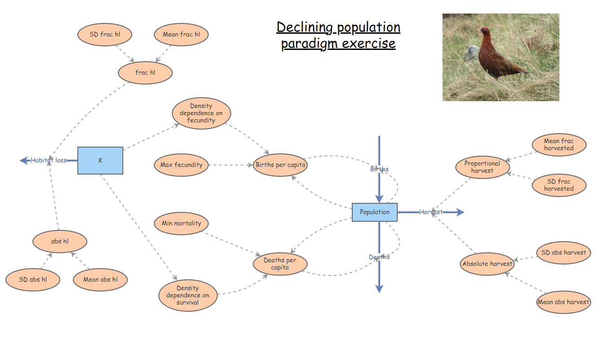

```{r setup, include=FALSE}
knitr::opts_chunk$set(echo = TRUE, cache = TRUE)
```


**Q**: Is the intrinsic rate of growth $r_{max}$ positive or negative for most species on earth? Why???

**Q**: Given that most species are capable of sustained growth and attaining large population size under favorable conditions, how do populations get small in the first place? Why are many populations declining despite their intrinsic ability to grow? Is it all random, or is it more systematic?

## Threats to populations

The answer of course is that the intrinsic ability to grow under ideal conditions is not the whole story. Populations are stocks with inflows and outflows- and if mortalities exceed births *under present conditions* the population will decline until these unfavorable conditions are reversed. 

In the "small-population paradigm" lecture, we discussed several **stochastic threats** to populations, including loss of genetic diversity (genetic drift), demographic stochasticity, catastrophic environmental events. These threats only really affect small populations. Large populations are mostly resilient to stochastic threats.

Large populations can be threatened too though! Factors that threaten large populations are generally called **deterministic threats**! 

The **declining population paradigm** focuses on the factors that make large populations small -- that is, it is the *study of those deterministic processes that cause population decline (that tip the balance and cause deaths to exceed births), and how these processes may be reversed through effective conservation management*. 

What are some factors that can *tip the balance* so to speak- so that growing or stable populations become declining populations? 

### Over-harvest


### Habitat loss and degradation


### Pathogens and parasites


### Climate change


This map shows the difference (anomaly) between current temperatures and mean (normal) temperatures recorded since 1880.

### Exotic invasive species


### Pollution


## The debate in Conservation Biology!

So, which one is more important for conservation? The declining-population paradigm or the small-population paradigm??

This "controversy" was ignited by a [very influential paper by Graeme Caughley](caughley1.pdf) in *Journal of Animal Ecology* in 1994.


In this paper, Caughley coined the terms 'small population paradigm' and 'declining population paradigm', and expressed a strong bias towards one paradigm and against the other...

> Conservation biology has two threads: the small-population paradigm which deals with the effect of smallness on the persistence of a population, and the declining- population paradigm which deals with the cause of smallness and its cure.

**Q**: Can you detect Caughley's bias in the above quote? 

**Q**: What do you think? Do you agree with Caughley? Take a moment to look over the paper and please comment on TopHat!


### In-Class Exercise: Deterministic threats

Let's try a worked example to illustrate the above points.

Let's start with a souped up scalar, density-dependent population -- should look something like this:

You can clone this model by clicking [here](https://insightmaker.com/insight/74417/declining-population-paradigm)





You should see logistic growth (with demographic stochasticity) if you hit the simulate button. Take a minute to run the base model and make sure you understand how it works.

For this exercise, let's change the initial population to 200 (half of K).

Also, make sure that the time step is 1 year, and the model should run for 50 years.

**Let's add a harvest process!**

- Assume that approximately 10% of the population is harvested each year (a fractional harvest). However, the true harvest rate is stochastic and *normally distributed*- occasionally harvest goes as high as 15%, and occasionally as low as 5%. Make sure you specify the 'fractional harvest' parameters (mean and stdev) in the model so that you achieve this range.   

**Q**: what value did you use for standard deviation of the normal distribution?

**Q**: is this variation in harvest rate best considered a type of *demographic stochasticity*, or a type of *environmental stochasticity*?     

**Q**: why doesn't the population decline to extinction? What has the harvest process done in this case?   

**Q**: What if you change the harvest rate- make it even more extreme? Starting at an abundance of 200, what is the expected final abundance (after 50 years) if the harvest rate is 40% and the variation (standard deviation) in harvest rate is 20%?   [tophat]

**Let's add a habitat loss process!**

Note that we are modeling habitat loss as a decline in carrying capacity. To do this, we impose larger density-dependence terms on survival and fecundity: because there is less habitat, the effects of crowding are more pronounced.   

- Remove any fractional harvest process for now (set frac harvested terms to 0)     

- Let's first model the case where 10% of K is lost each year (fractional habitat loss). 

- Run the simulation to visually track K along with population dynamics! 

**Q**: Does the reduction in K over time look realistic? Can you imagine other plausible shapes for this curve?

- Try running the model with 10% habitat loss (fractional habitat loss) AND 10% harvest (fractional harvest and fractional habitat loss). 

**Q**: Are the results different from what you expected?  

- Try changing the harvest process to be 35 *individuals* per year (absolute harvest rate). What happens? Return the absolute harvest to zero.

- Try changing the habitat loss process to be 5 *individuals* per year (absolute habitat loss). What happens?

- Try changing the habitat loss process to be 5 *individuals* per year (absolute habitat loss) AND the harvest process to be 35 *individuals* per year (absolute harvest rate). What happens?   [tophat]


**Q**: Try different combinations of deterministic threats (competing threats!). Can you identify some combinations that are *synergistic*- that is, that affect population decline or extinction risk more than simply adding the effects of each threat in isolation??  

**Q**: Does stochasticity in harvest rates matter more than stochasticity in habitat loss? Or vice versa?

[--go to next lecture--](LECTURE12.html)


