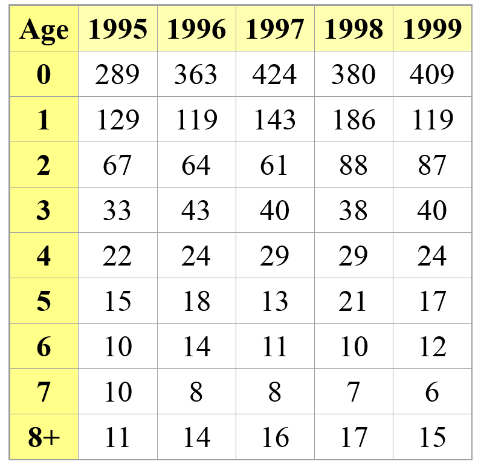
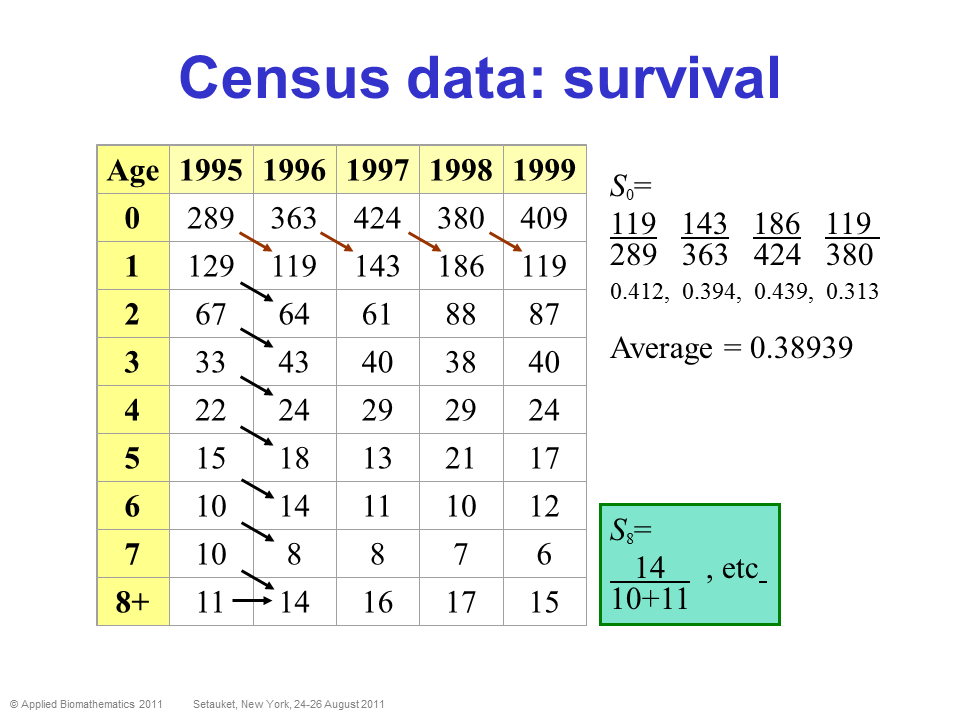
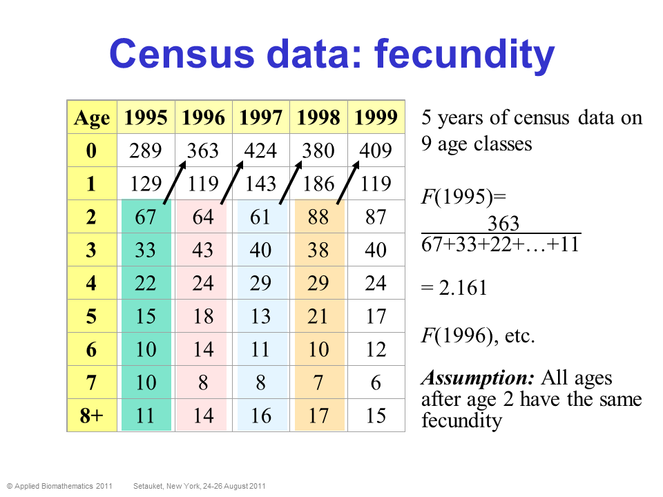
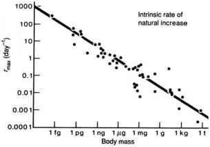
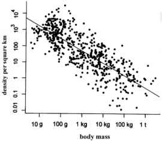
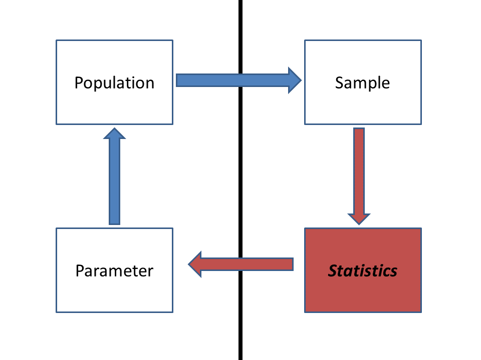
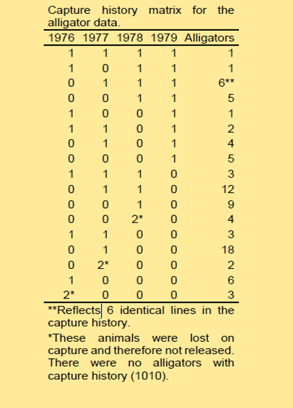
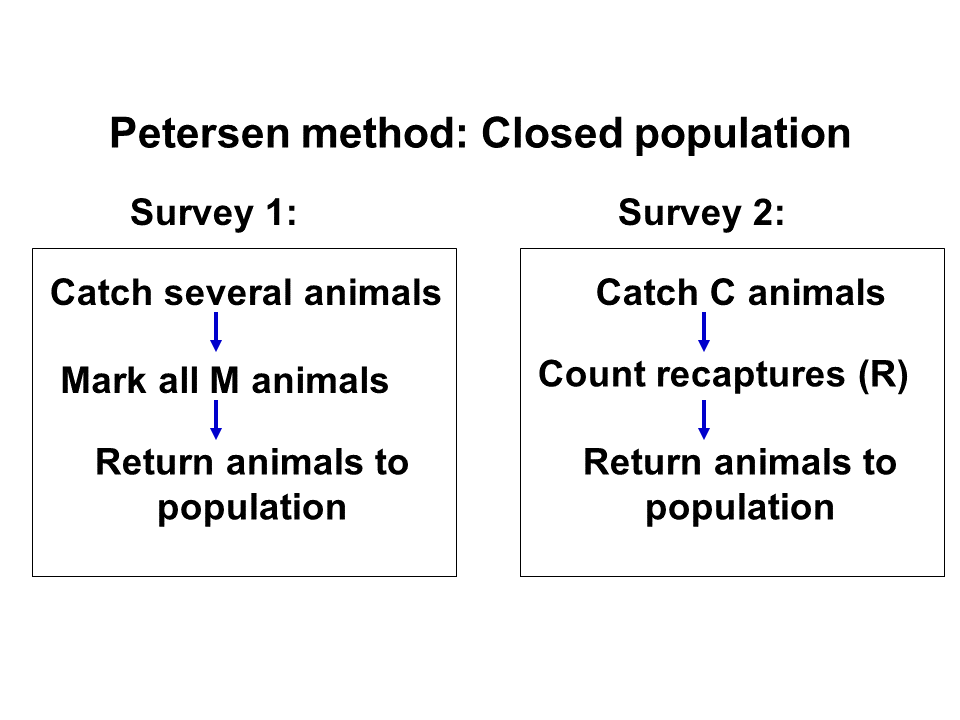
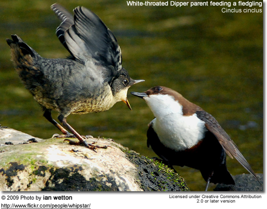

```{r setup, include=FALSE}
knitr::opts_chunk$set(echo = TRUE, cache = TRUE)
```

```{r echo=FALSE}

############################################################
####                                                    ####  
####  NRES 470/670, Lecture 15                          ####
####                                                    ####
####  Kevin Shoemaker                                   #### 
####  University of Nevada, Reno                        ####
####                                                    #### 
############################################################


############################################################
####  Parameter estimation                              ####
############################################################


```

# Parameter estimation for wildlife population models!

We have now gone through the basic mechanics of population modeling. But we have barely discussed where the parameter estimates come from!

This is the focus of the current lecture!

## Data requirements

### Scalar models (no age structure)
- Initial abundance ($N_0$)
- Mean population growth rate ($r$ or $r_{max}$)
- Variation in population growth rate (standard deviation for a normal distribution representing environmental stochasticity)
- Carrying capacity of the population ($K$; equilibrium abundance of logistic model)

### Stage-structured (life history) models
- Initial abundance ($\mathbf{N_0}$) (vector of initial abundances for all stages)
- Stage-specific vital rates (fecundity, survival; fill in a transition matrix) 
- Temporal variation in stage-specific vital rates (environmental stochasticity) 
- Dependence of vital rates on density (e.g., how fecundity decreases as population gets more crowded)    
    - Which vital rates are density-dependent?    
  
### Metapopulation (spatial) models
- Spatial distributions of suitable habitat patches (define patches)
- Spatial variation in vital rates (e.g., variation in habitat quality among different patches)
- Correlation in environmental stochasticity among patches 
- Dispersal rates among habitat patches
- Habitat requirements of different life stages
- For "classical" metapopulation models: rates of colonization and extinction in habitat patches

## Data sources!

### Life tables

As you recall, classical life tables represent a single cohort that has been followed over time until the last one has died. 

NOTE: in practice, it is nearly impossible to follow a single cohort over time in the wild (although life tables are commonly available for captive populations). Therefore, in practice, most published life tables for wild populations use the **static life table**, which compares population size from multiple different cohorts (across the entire range of ages), at a single point in time. Static life tables assume the population has a stable age structure —- that is, the proportion of individuals in each age class does not change from generation to generation. This assumption is often violated in natural populations, but in the absence of better data, this method can be better than nothing!


```{r echo=FALSE}
lifetable <- read.csv("life_table.csv")
```

```{r results='asis', echo=FALSE}
knitr::kable(lifetable,caption="",col.names = c("x","S(x)","b(x)","l(x)","g(x)"))

```

**PROS**
- Summary of survival and fecundity schedules, often available in the literature. Be careful when using data from captive populations!

**CONS**
- Makes unrealistic assumptions (especially the *static life table* method).
- Can not be used to estimate environmental stochasticity
- Can not be used to estimate density dependence
- Ignores **imperfect detection** and the fact that some age classes are less detectable than others   
- Remember, it's not always perfectly straightforward to translate into a matrix-based (age-structured) population model- but it can be done!

### Census data!

Census data is ultimately what we all **wish** we had! It means we follow a population over time, and we know exactly how many individuals of each stage are in the population each year. We have *perfect detection!!!!*

In this case, computing survival and fecundity (and variation in these parameters, and density-dependence) is relatively straightforward!







**PROS**
- Can estimate survival and fecundity, env. stochasticity, density dependence- pretty much everything we want for a population model!

**CONS**
- Very rarely (if ever) available!!
- Ignores **imperfect detection** (assumes perfect detection), which is almost always not realistic.

### Capture-mark-recapture (CMR)

**PROS**
- Can estimate survival, variation in survival, lambda, recruitment, dispersal rates. 
- Probably the most widely used source of data for population models!

**CONS**
- Few downsides, although the analytical techniques can be difficult to master
- Mounting a proper CMR study can be very costly, and require many years of data. 
- Estimating landscape-scale movements can require an even more costly and time-consuming study.
- Emigration and survival can be difficult to tease apart in many cases. 

See below for more! Also this is the main focus of the Population Dynamics course (NRES 488, the next course in the Wildlife Ecology and Conservation sequence!)

### Data on spatial structure/habitat
- See [links](FINAL_PROJECTS.html) on Final projects page

### What if there's "no data"?

Remember the ["Stone Soup" analogy!](https://en.wikipedia.org/wiki/Stone_Soup) - even when you think there's no data, there probably is more than there initially appears!

- Use algebra to construct a full age-structured transition matrix from available information
    - E.g., we are missing information on hatchling survival. We only know: 
        - Juvenile and adult survival rates      
        - Nesting success     
        - Population growth (lambda) is 1.09     
        - Now we can solve for hatchling survival!    
        - For an example of this, see [Congdon et al 1993](congdon et al 1993.pdf)     
- Simplify! (Models are always simplified representations of reality)    
    - Ignore age structure? (i.e., use scalar model)    
    - Ignore density-dependence?      
    - Ignore trophic interactions (we usually make this simplification anyway!)      
    - Ignore abundance entirely (e.g., use classical metapopulation model)       
- Conservative strategies (use *worst case scenario*)!    
    - Density-independent model is conservative, so if you don't have data on D-D, then maybe just ignore it!     
    - With parameter uncertainty, use the worst case scenario    
    - Under decline trends, use the worst case scenario   
- Use data from similar species!      
   - E.g., tamarin species have similar life histories, so use data on golden lion tamarins to model golden-headed lion tamarins.
- Expert Opinion
    - See below... 
- National Databases
    - See [links](FINAL_PROJECTS.html) on Final projects page
- [Allometries](https://www.astronomyclub.xyz/maternal-effect/does-ecology-have-laws.html)
    - e.g., Fenchel's allometry
    - This type of thinking (looking for broad patterns across species) is often called "Macroecology"
    
    




## Aside- is expert opinion okay to use???

- Not ideal, because it is hard or impossible to validate, and hard to document, but ...
- That is what will be done in any case!
- And it is better to use it than to do nothing
- And it is better to document that expert opinion was used than to proceed with conservation planning in the absence of stating sources and assumptions
- It is a starting point (and sometimes a reasonable one)


## Capture-mark-recapture (CMR) analysis




### PVA Parameters estimable from CMR data

- Survival rate (possibly age or size structured)
- Fecundity (entry of new individuals in the population)
- Recruitment (entry of new individuals into the adult population)  
- Abundance
- Lambda (finite rate of growth)
- Environmental influences on survival rates and fecundity
- Temporal process variance (env. stochasticity)
- Dispersal rates

### The data needed for CMR analysis: capture histories

Consider a project designed to monitor a population of alligators. These alligators were monitored for four years, from 1976 to 1979. 

Each row in the following table represents a unique possible history of captures:

A "1" indicates that an animal was successfully captured in a given year, and subsequently released. 

A "0" indicates that an animal was not successfully captured in a given year.

A "2" indicates that an animal was successfully captured in a given year but was not released back into the population (probably died due to handling or capture).



### Two main types of CMR analyses

#### Closed population models
We assume that the population is closed (no BIDE processes!). That is, abundance does not change!
We attempt to estimate abundance!

- No mortality
- No births
- No immigration
- No emigration
- All individuals are observable (but not necessarily observed...)



Parameters estimated:

- Abundance

M = the number of individuals marked in the first sample   
C = total number of individuals captured in 2nd sample   
R = number of individuals in 2nd sample that are marked   

We can use the following formula to estimate abundance (the **lincoln-peterson estimator**): 

$N = \frac{M \times C}{R}$


#### Open population models
We assume that the population is open to one or more of the BIDE processes. That is, abundance CAN change! 
We attempt to estimate the processes driving abundance change (often, survival rates)

- Populations open to birth, death, and possibly even migration (abundance can change during the study).
- Enables estimation of the drivers of population dynamics over extended time periods 
- Often of great interest to ecologists and managers.


### Maximum likelihood: a framework for statistical inference!

**FOR CMR ANALYSIS**:
- What value of survival maximizes the probability of generating the observed capture histories?

EXAMPLE:

Consider the following capture history for a single individual: 

```
1 0 1 1
```

This individual was marked and released upon initial capture. It was not captured in the next survey, but then was captured in each of the next two subsequent surveys.  

What is the probability of observing this capture history?

> [(Probability of surviving from time 1 to 2) X (Probability of not being seen at time 2)] X [(Probability of surviving from time 2 to 3) X (Probability of being seen at time 3)] X [(Probability of surviving from time 3 to 4) X (Probability of being seen at time 4)]

This can be written:

$L_1 = \phi_1(1-p_2) \cdot \phi_2p_3 \cdot \phi_3p_4$


How about the following capture history for a single individual: 

```
1 0 1 0
```

What is the probability of observing this capture history?

> [(Probability of surviving from time 1 to 2) X (Probability of not being seen at time 2)] X [(Probability of surviving from time 2 to 3) X (Probability of being seen at time 3)] X

-- either -- 

>  [(Probability of surviving from time 3 to 4) X (Probability of not being seen at time 4)]

-- or --

>  [(Probability of NOT surviving from time 3 to 4) 

This can be written:

$L_1 = \phi_1(1-p_2) \cdot \phi_2p_3 \cdot \left \{(1-\phi_3)+\phi_3(1-p_4)  \right \}$

**Q**: if survival were 100% and capture probability were 100%, what is the probability of observing the above capture histories?

**Q**: what about if survival was 100% and capture probability was 75%? 

Maximum likelihood estimation is the process of finding those values of the parameters $\phi$ and $p$ that would be most *likely* to generate the observed capture histories!

This model is known as the *Cormack-Jolly-Seber* model (CJS), and is the most common analysis performed by Program MARK. 

**Q**: Why is $\phi$ also known as "apparent" survival? Why is it not "true" survival???

#### Key assumptions of the CJS model

- All individuals in population are equally detectible at each sampling occasion (each capture session represents a totally random sample from the population)    
- Marks are not lost or missed by surveyors    
- All emigration is permanent (equivalent to a mortality)    

### Program MARK

MARK is a numerical maximum-likelihood engine designed for mark-recapture analysis. You input a capture history dataset and MARK will output results such as survival rate and capture probability!! 

## Example of an open-population mark-recapture analysis!

Let's run through a CJS analysis in R! To follow along, please [save this script and load it up in Rstudio](LECTURE15.R).

NOTE: this analysis includes both males and females (unlike the example in Lab 7), so the results will look somewhat different!



The European dipper data is THE classic example of a CMR dataset. Let's look at it!


```{r}

###########
# Cormack-Jolly-Seber (CJS) model in R
###########

library(marked)      # install the 'marked' package if you haven't already done this!
data("dipper")
head(dipper,10)

```


Here we use the "marked" package in R (instead of MARK) to do the ML parameter estimation!

```{r}

##########
# load data!

data(dipper)

#############
# Process data

dipper.proc=process.data(dipper,model="cjs",begin.time=1)  # Helper function- process the data for CJS model
dipper.ddl=make.design.data(dipper.proc)    # another helper function- process data!

##########
# Fit models

# fit time-varying cjs model


capture.output(suppressMessages(   # note: this is just to suppress messages to avoid cluttering the website...
      mod.Phit.pt <-  crm(dipper.proc,dipper.ddl,model.parameters=list(Phi=list(formula=~time),p=list(formula=~time)),method="Nelder-Mead",hessian = T)
),file="temp.txt") 

mod.Phit.pt   # print out model
mod.Phit.pt$results$AIC       # extract AIC

########
# fit time-invariant cjs model

capture.output(suppressMessages(
  mod.Phidot.pdot <- crm(dipper.proc,dipper.ddl,model.parameters = list(Phi=list(formula=~1),p=list(formula=~1)),method="Nelder-Mead",hessian = TRUE)
),file="temp.txt")

mod.Phidot.pdot
mod.Phidot.pdot$results$AIC

########
# fit sex-dependent cjs model

capture.output(suppressMessages(
  mod.Phisex.psex <- crm(dipper.proc,dipper.ddl,model.parameters = list(Phi=list(formula=~sex),p=list(formula=~sex)),method="Nelder-Mead",hessian = TRUE)
),file="temp.txt")

mod.Phisex.psex
mod.Phisex.psex$results$AIC

###########
# compare all models with AIC
###########

######
# Set up models to run (must have either "Phi." or "p." in the name)
Phi.dot <- list(formula=~1)       
Phi.time <- list(formula=~time)
Phi.sex <- list(formula=~sex)
Phi.timesex <- list(formula=~sex+time)
p.dot <- list(formula=~1)
p.time <- list(formula=~time)
p.sex <- list(formula=~sex)
p.timesex <- list(formula=~sex+time)

cml=create.model.list(c("Phi","p"))    # create list of all models to run

######
# Run all models

capture.output(suppressMessages(suppressWarnings(
  allmodels <- crm.wrapper(cml,data=dipper.proc, ddl=dipper.ddl,external=FALSE,accumulate=FALSE,method="Nelder-Mead",hessian=TRUE)
)),file="temp.txt")

######
# AIC model selection

allmodels

#######
# get parameter estimates and confidence intervals for best model

allmodels[[1]]

allmodels[[11]]

#######
# make predictions and plot them. 

predict(allmodels[[1]])$Phi

Phi_by_year <- predict(allmodels[[11]])$Phi    # predict Phi for all years (based on the best Phi(t) model)

suppressWarnings( suppressMessages( library(Hmisc,quietly = T) ))    #load Hmisc package- has a nice error bar function
plot(1:nrow(Phi_by_year),Phi_by_year$estimate,xlab="Year",ylab="Survival",ylim=c(0,1),main="Variability in Survival, dipper demo")
errbar(1:nrow(Phi_by_year),Phi_by_year$estimate,Phi_by_year$ucl,Phi_by_year$lcl,add=T)

```

What is our estimate for mean survival?

```{r}

#######
# Compute the mean survival rate for the population

mean(Phi_by_year$estimate)

```

What is the environmental stochasticity?

```{r}

#######
# Compute the environmental variablility in annual survival rates. 

sd(Phi_by_year$estimate)

```

### Program MARK!

MARK is free software, and can be downloaded from [here](http://warnercnr.colostate.edu/~gwhite/mark/mark.htm)

The demo from Lab 7 can be found [here](LAB7.html#open-population_models)

[--go to next lecture--](LECTURE16.html)


