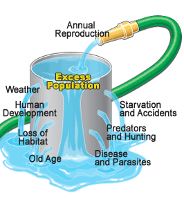
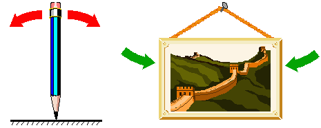

```{r setup, include=FALSE}
knitr::opts_chunk$set(echo = TRUE, cache = TRUE)
```

## What is density dependence (D-D)?

Last week we went through the mathematics of exponential growth. This week we will explore basic models of **density dependence**. Exponential growth, as you have seen, leads to craziness. It is not sustainable. As Malthus noted, resources are finite, and sooner or later exponentially growing populations will find their limits. 

**Density**: In D-D, *density* basically refers to the number of conspecific individuals that you are competing with for food and other resources. The more you compete with others of your own species, the less favorable your **vital rates** (e.g., per-capita death rate, *d*, increases or per-capita birth rate, *b*, decreases)! As *N* goes up, vital rates take a turn for the worse. 

## Regulation!

First of all, we mentioned in our systems ecology discussion that positive feedbacks are not sustainable, because increases mean faster increases, mean faster increases, etc. (a vicious circle). Density dependence is a kind of feedback, but it is NOT a positive feedback. That's right- it is a *negative feedback*! Which is also known as a *stabilizing feedback*. As we discussed before, negative feedbacks are essential for well-regulated systems. Recall the example of homeostasis in organismal biology. If blood sugar goes up, the body will work to lower it, and vice versa. 

Same with populations. In a regulated population, an increase in abundance will cause a decrease in the population growth rate, and a decrease in abundance will cause an increase in the population growth rate. In population ecology (and especially fisheries science), the latter is often called *compensatory growth*! You can't have a regulated population without some kind of negative feedback. 

**thought Q**: What are some possible mechanisms of density-dependence? That is, why could vital rates become less favorable at higher densities?

**thought Q**: Are all wild populations regulated? Is density-dependent population regulation a "law of nature"?

## Logistic growth

Logistic growth can be described mathematically by the following equation: 

$\Delta N = r \cdot N_t \cdot \left ( 1 - \frac{N}{K}  \right )$

This is probably the *second most important equation of population ecology* (after basic exponential growth!). 

We will go into more detail in lab, but Let's break this equation down a bit. 

The first part of this equation looks familiar, right?

$\Delta N = r \cdot N_t$

What about the second part,

$\left ( 1 - \frac{N}{K}  \right )$

You can think about $\frac{N}{K}$ as the *used portion of carrying capacity*

By the same token, you can think about $\left ( 1 - \frac{N}{K}  \right )$ as the *unused portion of carrying capacity*. 

When carrying capacity is mostly unused, _population growth resembles basic exponential growth_! 

When carrying capacity is mostly used up, _population growth resembles_, well..., _no growth at all_!

**Thought Q:** Given the two above statements, can you figure out what population dynamics should look like under logistic growth, starting with a very small population?



## Carrying capacity is an equilibrium point!

A stock-flow system is at an **equilibrium** point when [Flows In] are equal to [Flows Out]. That is, if opposing forces cancel each other out.   

As Gotelli shows, and we will go over in detail, you can derive the logistic growth equation by making *b* and *d* (from the standard population growth equation) both linearly dependent on density:

$b=b_{max}-a*[Density]$

where $b_{max}$ is the maximum, or ideal, per-capita birth rate and $a$ is the density dependence term.

Similarly,

$d=d_{min}+c*[Density]$

where $d_{min}$ is the minimum, or ideal, per-capita death rate (1-maximum survival rate) and $c$ is the density dependence term.

We can plot these equations out in R:

```{r}
Density <- seq(0,500,1)  # create a sequence of numbers from 0 to 500, representing a range of population densities

## CONSTANTS

b_max <- 0.8  # maximum reproduction (at low densities)
d_min <- 0.3  # minimum mortality 

a <- 0.001    # D-D terms
c <- 0.0005

b <- b_max - a*Density
d <- d_min + c*Density

plot(Density,b,type="l",col="green",lwd=2,ylim=c(0,1),main="Density-Dependence!",ylab="b or d")
points(Density,d,type="l",col="red",lwd=2)
axis(4,at=seq(0,1,0.2))
#mtext("d",4)
legend("bottomleft",col=c("green","red"),lty=c(1,1),legend=c("per-capita birth rate","per-capita mortality"),bty="n")

  
  
  
```

**Thought Q**: What is the equilibrium point in this system? That is, what is the (non-zero) abundance/density at which population growth is equal to zero??

This equilibrium is known as **K**, or **carrying capacity**?



## Stable and non-stable equilibria

A **stable equilibrium**, when perturbed, returns to the equilibrium point

A **non-stable equilibrium**, when perturbed, does NOT return to the equilibrium point 

Is the image on the left a stable or a non-stable equilibrium??

What about the image on the right?

What about **K**, or **carrying capacity**?

Let's find out!

## In-class exercise: logistic growth

First of all, from now on try to start saving your working InsightMaker models, since we will often be building from previous models (so we don't have to start from scratch every class!). To build off of a previous Insight, open a previous Insight (e.g., your basic exponential growth model-- or clone [this model](https://insightmaker.com/insight/68236/Basic-population)) and choose "Clone Insight" in the upper right corner to create a copy that you can edit. 

Here is the scenario we will model: both *b* and *d* are **density-dependent**. We will replicate the model from the R code and figure above- this time in InsightMaker! 

```
CONSTANTS
- [Maximum per-capita birth rate] = 0.8 individuals per individual per year   
- [Minimum per-capita death rate] = 0.3 individuals per individual per year    
- [Density dependence on fecundity] (a) = 0.001    
- [Density dependence on mortality] (c) = 0.0005  
```

```
EQUATIONS
- [Per-capita birth rate] = [Maximum per-capita birth rate] - [Density dependence on fecundity] * [Turtles] 
- [Per-capita death rate] = [Minimum per-capita death rate] - [Density dependence on mortality] * [Turtles] 
```

How can we do this in InsightMaker? 

1. Load a basic exponential-growth model. Rename the main [Stock] *Box Turtles*. This [Stock] should have two [Flows], one [Flow In] named *Births* and one [Flow Out] named *Deaths*. Both *Births* and *Deaths* should be defined as the product of *turtles* and per-capita rates, respectively called *Births per capita* and *Deaths per capita* (each defined on the canvas as [Variables]). This model should be very familiar!! 

2. Initialize the population of *Turtles* to 5 (way below carrying capacity).   

3. Make four new [Variables] on the canvas, to represent the four constants in our model.   

4. Set the *Maximum per-capita birth rate* to 0.8 (turtles produced per turtle per year). Set the *Minimum per-capita Death rate* to 0.3. Set the *Density dependence on fecundity* to 0.001.  Set the *Density dependence on mortality* to 0.0005.  

5. Make the appropriate connections, as in the figure above, and use the equation window to make sure the equations are correct.   

6. Change the settings so that the simulation runs for 100 years.   

Your model should look something like this! (if you don't already have a model like this, clone [this model](https://insightmaker.com/insight/70353/Logistic-Growth-1#))


7. Run this model. Does the model behave as you would expect?   

**Q:** What happens if population size starts out *at* carrying capacity?  [tophat]  
**Q:** What happens if population size starts out *above* carrying capacity? [tophat]    
**Q:** Is this a stable equilibrium? [tophat]    
**Q:** Can a wild population ever be at a non-stable equilibrium? What about a stable equilibrium? Why is it important to know about non-stable equilibria?

8. Consider the basic logistic growth equation:   

$\Delta N = r \cdot N_t \cdot \left ( 1 - \frac{N}{K}  \right )$

Pull up your InsightMaker model for basic logistic growth with an $r_{max}$ term (double-headed arrow). Or you can clone it from [here](https://insightmaker.com/insight/71146/Basic-logistic-growth-rmax). It should look something like this:


Make your initial population size very small compared to carrying capacity.     

**Q:** What happens if $r$ is zero? What happens to carrying capacity?      
**Q:** Which population is more likely to be found at or near K in nature? A population with very large $r$ or very small $r$?     
**Q:** How does this discussion relate to the concept of "r-selected" and "K-selected" species?
 

**Q:** Is a high value of $r$ good or bad for conservation?


[--go to next lecture--](LECTURE5.html)


