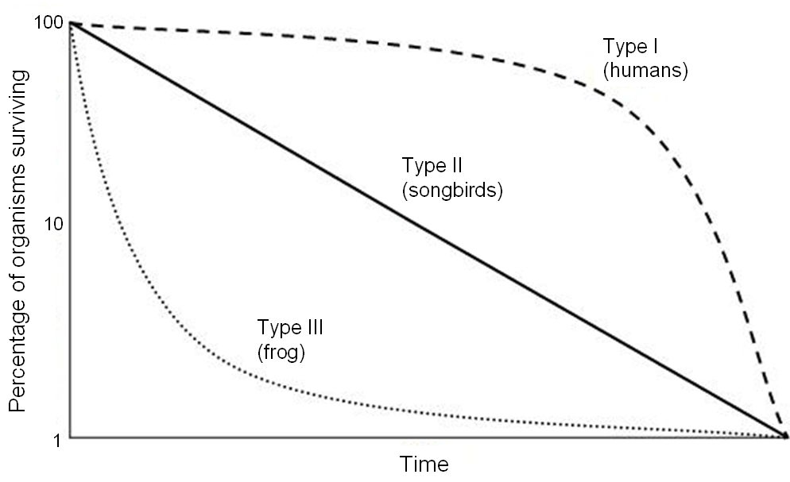

```{r setup, include=FALSE}
knitr::opts_chunk$set(echo = TRUE, cache = TRUE)
```

When we began modeling wildlife populations, we treated $b$ and $d$ (per-capita birth rate and fractional death rate) as constants. This resulted in exponential growth.

Then we allowed $b$ and $d$ to change (becoming less favorable to growth) as population density increased- this resulted in logistic (S-shaped) population dynamics. 

Here we ask: what if population vital rates ($b$ and $d$) change as individuals get older (i.e., what if $b$ and $d$ are 'age-structured')? 

How can we model age-structured population vital rates? How might this affect population dynamics? 

{width=40%}

Take this Indian elephant for example. How does the per-capita birth rate (b) depend on age for this species?

We might imagine it looks something like this!

```{r echo=F}
Elephant_age <- seq(0,60,by=2)

Birth_rate <- c(rep(0,times=7),seq(0,0.3,length=4),rep(0.3,times=15),seq(0.3,0,length=5))

names(Birth_rate) <- Elephant_age

barplot(Birth_rate,xlab="Age (years)",ylab="b, per-capita birth rate",col="blue",ylim=c(0,0.5))

```

{width=40%}

What about per-capita death rates for a tortoise? We might imagine something that looks like this...

```{r echo=F}
Tortoise_age <- seq(0,120,by=5)

Death_rate <- c(seq(0.7,0.05,length=5),seq(0.02,0.02,length=16),seq(0.02,0.5,length=4))

names(Death_rate) <- Tortoise_age

barplot(Death_rate,xlab="Age (years)",ylab="d, per-capita death rate",col="blue")

```

So, for many species per-capita birth rates and death rates are fundamentally dependent on age!

{width=40%}

**Q:** Imagine you were trying to re-establish a population of spadefoot toads, which tend to reproduce for the first time in their third year of life. You take 1000 tadpoles from a captive population and place them in a temporary wetland right after a rainstorm (to maximize survival rate). What would population growth look like over the next 4 years, assuming the reintroduction strategy was successful? [PointSolutions]

## Aside: sex-structured vital rates

**Q:** Can you think of some real-world examples where vital rates might differ between males and females?

**Q:** Is sex structure important to consider when modeling populations? Why or why not?

{width=40%}

**Q:** Imagine a population of 100 golden-headed lion tamarins (*Leontopithecus chrysomelas*) that consists of all adult males and post-reproductive females. What is the conservation status of this population?  

## Life table!

Age-structured populations are often represented by a table called a **life table**. A life table typically represents a single **cohort** (group of organisms of the same species that are born during the same year) and whose survival and birth rates are tracked across time. 

Here's an example:

```{r include=FALSE}
lifetable <- read.csv("life_table.csv")
```

```{r results='asis', echo=FALSE}
knitr::kable(lifetable,caption="",col.names = c("x","S(x)","b(x)","l(x)","g(x)"))

```

### Fecundity schedule

The fecundity component of the life table is called the "fecundity schedule"! The term $b(x)$ represents the per-capita birth rate for females of age x.  

### Survivorship schedule

Fecundity is only half the story! The survival component of the life table is called the "survivorship schedule"! 

The term **cohort** represents a bunch of individuals in a population that were all born at the same time. 

In a life table, the term S(x) refers to the number of individuals from a particular cohort that are _still alive x years after the cohort was born_. 

From this raw data, we compute two terms, called **survivorship** and **survival rate**

The term $l(x)$ represents the _proportion of the cohort surviving from age 0 to age x_. This is known as **survivorship**.

The term $g(x)$ represents the _proportion surviving from age x to age x+1_. This is called the **survival rate** (contrast this with survivorship!).

### Types of survivorship curves...

*Survivorship curves* describe how the logarithm of survivorship ($log(l(x))$) drops off with age. 

There are three main types of survivorship curves (also called survivorship schedules), and these curves are classified as **Type I**, **Type II**, and **Type III**.

These three types of **life history** pattern can be illustrated with three real-world examples: humans, songbirds, and frogs.

#### Type I
{width=30%}

#### Type II
{width=30%}

#### Type III
{width=30%}

{width=60%}

(Note the logarithmic scale on the Y axis!)

**Q:** Which survivorship curve is the most common in nature?? [PointSolutions] (remember, you're not graded on correctness- just take a guess if you're not sure!)

## In-class exercise: age-structured population growth

In this exercise we will explore some facets of **age-structured populations**. 

1. Load up the life table from earlier in this lecture, by clicking [here](life_table.csv). Use this table to compute the **net reproductive rate, $R_0$**. This represents the expected number of female offspring produced per female over her lifetime. This is also known as *lifetime reproductive potential*! This can be computed as:

$R_0 = \sum_{x=0}^k l(x)\cdot b(x)$

Where $k$ is the maximum age. 

Try to implement this formula in Excel. What's the answer?

2. If the net reproductive rate, $R_0$ is above one, then the population is above the **replacement rate** of 1, and therefore the population will grow. If $R_0$ is less than 1, then the population will decline. This sounds familiar, right? Just like the finite rate of growth, $\lambda$ (the multiplier needed to increment abundance from one time step to the next). 

BUT, what is the time frame of $R_0$? What is the time frame of $\lambda$? They are different right? The difference is that $R_0$ describes growth per **generation**!. 

What is a **generation**? The most common definition (for generation time) is the _Average age at which individuals in a cohort produce offspring_ (consider all the offspring produced by the cohort- what is their average age when they first become parents?). This can be computed from the life table as:

$G = \frac{\sum_{x=0}^{k}l(x)\cdot b(x)\cdot x}{\sum_{x=0}^{k}l(x)\cdot b(x)}$

Try to implement this in Excel (or another spreadsheet software).

**Q:** What is the *generation time* of the population in the table?

3. Now, can you compute the *intrinsic rate of growth* ($r$) for this age-structured population? 

To a first-order approximation, you can use this equation:

$r = \frac{ln(R_0)}{G}$ [PointSolutions]

Just looking at this equation, you see that organisms with longer generation times ($G$) have slower intrinsic rates of growth, all else being equal. 

And you can estimate the finite rate of growth ($\lambda$) for this population like this:

$\lambda = e^{r}$

4. Load up an stage-structured model in InsightMaker. You can clone [this one,  here](https://insightmaker.com/insight/6vZsNuzGIbisYsFVCSLWZK/Stage-structured-population). 


    4a. Initialize the population like the spadefoot toad example from above- with only juveniles in the population at time 0. What population dynamics occur at the beginning of the simulation? What about the end of the simulation?
    
    4b. Can you modify the initial abundance of juveniles, subadults and adults so that the population exhibits smooth exponential growth for all three stage classes (and the population as a whole)? This is called **Stable Stage Distribution (SSD)**
    
    4d. Now change the **Adult mort rate** to 0.65. What happens? Is this a growing population? How many subadults would need to be added to the population each year (population supplementation) to maintain a stable or growing population of >20 adults?  [PointSolutions]

**Q**: Is supplementation the best strategy for conserving this population?    

[--go to next lecture--](LECTURE7.html)


