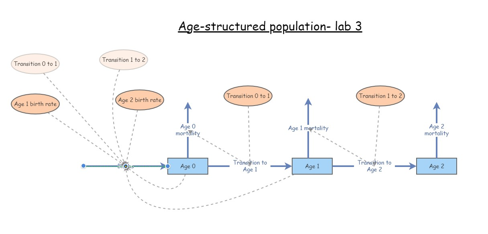

```{r setup, include=FALSE}
knitr::opts_chunk$set(echo = TRUE, cache = TRUE)
```


```{r echo=FALSE}

############################################################
####                                                    ####  
####  NRES 470, Lecture 7                               ####
####                                                    ####
####  Kevin Shoemaker                                   #### 
####  University of Nevada, Reno                        ####
####                                                    #### 
############################################################


############################################################
####  Matrix population models                          ####
############################################################


```


# Matrix population models

First of all, this lecture is full of R code (R makes it easy to run matrix population models!). If you want to follow along in R, you can find the R script [here](LECTURE7.R). I recommend right-clicking on the link, saving the script to a designated folder, and loading up the script in RStudio.     

## Why matrices? 

### Reason 1: simplify!



You might recognize this InsightMaker model from Lab 3. This represents an age-structured population with only three age classes. Imagine if there were five age classes, or 10? What if you could jump from (e.g.) stage 3 to stage 5? Or from stage 5 back to stage 3? How many lines would you have to draw, how many equations would you have to put in all the different flows? It would be tedious, and you could easily run into errors that would be very hard to uncover! 


Consider the teasel example from our textbook. It's possible to implement this model in InsightMaker, but it would be tedious and potentially prone to error. And this is far from the most complicated populations out there (although notice that plants can do some things that animals can't do- for instance go backwards in developmental stage. With matrix models, there is an easier way!


The population vital rates for pretty much any age-structured or stage-structured population can be represented as a **transition matrix** (or, projection matrix), which summarizes all the information about survival, birth rates, and transitions between stages! (and the fact that a life history like teasel can be represented by a transition matrix illustrates the generality of this concept!)

For example, the teasel vital rates can be summarized in [this matrix](teaselmatrix1.csv):

```{r}

# Teasel example -------------------------------
# Teasel example from Gotelli: summarizing a complex life history!

teasel <- read.csv("teaselmatrix1.csv", header=T)      # read in the teasel transition matrix from Gotelli
teasel <- teasel[,-1]                                  # remove the row names
teasel_matrix <- as.matrix(teasel)                     # convert to a matrix (from a data frame)
colnames(teasel_matrix) <- names(teasel)               # assign row and column names
rownames(teasel_matrix) <- names(teasel)
teasel_matrix                                          # print the matrix

```

Isn't that *elegant*!!

#### Aside: stage-structure vs age-structure

In the previous lecture, we talked about 'age-structured populations'. What we meant by that is that the population vital rates (e.g., b and d) varied by age. 

Sometimes, it is convenient to classify individuals within a certain age range as belonging to a particular life-history stage. For example, we might classify the life history of a grizzly bear like this:

Age 0-1: newborn     
Age 1-2: yearling     
Age 2-5: subadult     
Age 6+: adult     

This can simplify our models considerably. For example, consider a species like a sea turtle, with up to 75 or 100 years of life. You could build a model in which you have 100 stocks, one for each year of life. OR, you could have 5 or so stocks representing age ranges in which sea turtles tend to have consistent(ish) vital rates. For example, we might divide the sea turtle life history into the following stages:

Age 0-1: hatchling      
Age 1-5: young juvenile     
Age 5-10: older juvenile      
Age 10-17: subadult      
Age 18+: adult      

By using stages, we have simplified our model from having 100 stocks (with even more associated flows/transitions) to a model with only 5 stocks- and we are still accurately representing how vital rates change with age (the model is still biologically realistic). 

Matrix population models can represent age-structured and stage-structured models with equal simplicity and elegance. 

The term 'Leslie Matrix' refers to an age-structured matrix population model. When a matrix is used to represent a stage-structured population, it is often called a 'Lefkovitch" Matrix. 

### Reason 2: projection!

In one of the questions in Lab 3, your were asked to use a life table to predict the number of births in a population one time step in the future. As you probably realized, this is not as straightforward as it sounds!

Life tables are great for summarizing survivorship schedules and other aspects of age-structured populations. But _life tables are not great for projecting age-structured abundance into the future_!

You know what *is* great for projecting age-structured abundance into the future? (MATRICES of course!)  

For example, let's project a teasel population 1 year into the future:

First of all, we need to begin with a teasel population **vector**...

```{r}

# Summarize initial age-structured abundance as a matrix with one column

Initial_teasel <- matrix(c(1000,1500,200,300,600,25),ncol=1)         # initial population size (population vector; matrix with 1 column!)
rownames(Initial_teasel) <- rownames(teasel_matrix)                  # add row and column names
colnames(Initial_teasel) <- "Abundance"
Initial_teasel

```

Then all we need to do is 'matrix-multiply' this **vector** of abundances by the **transition matrix** from above! Each time we do this multiplication step, we advance one year! It's that easy!

NOTE: matrix multiplication (percent-asterisk-percent in R) is not the same as standard multiplication (asterisk in R). We will go over this in the intro to lab 4 a bit later.  

Here's how we can do this in R!

```{r}

# Project the population at time 1

Year1 <- teasel_matrix %*% Initial_teasel   # note: the '%*%' denotes 'matrix multiplication' in R. We'll go through this more later.     
Year1
  
```

How easy is that?!

To compute teasel abundance in year 2 of our simulation, we can simply repeat:

```{r}

# Project the population at time 2

thisYear <- Year1
nextYear <- teasel_matrix %*% thisYear
nextYear  # now we get the (age structured) population size at time 2!     

```

We could use this strategy to simulate abundance for ten years (or 20, or 30, or 10000)...

Notice the use of a **for loop** here!

```{r}

# Use a FOR loop to project the population dynamics for the next 10 years!

nYears <- 10
tenYears <- matrix(0,nrow=6,ncol=nYears+1)          # initialize storage array for recording age structured abundances for the next 10 years. 
rownames(tenYears) <- rownames(Initial_teasel)      # assign row and column names
colnames(tenYears) <- seq(0,10)
tenYears[,1] <- Initial_teasel                      # initialize the simulated abundances

# run the for loop!

for(t in 2:(nYears+1)){    # here we use 't' as our looping variable, but we could choose any name we want
  tenYears[,t] <-  teasel_matrix %*% tenYears[,t-1]     # perform matrix multiplication for each year of the simulation!
}

tenYears


```

Finally, we can plot out the abundance of each stage over 10 years!

```{r echo=FALSE}

# Plot the projected population trajectory over the next 10 years 

plot(1,1,pch="",ylim=c(0,60000000),xlim=c(0,11),xlab="Years",ylab="Abundance",xaxt="n")    # make empty plot
cols <- rainbow(6)        # set colors for each stage
for(s in 1:6){
  points(tenYears[s,],col=cols[s],type="l",lwd=2)       # plot out each stage
}
axis(1,at=seq(1,11),labels = seq(0,10))      # add x axis labels
legend("topleft",col=cols,lwd=rep(2,6),legend=rownames(tenYears))      # add legend

```

So projection is easy with matrices! What more reason do we need to convince ourselves of why matrix population models are worth knowing? Well, how about this...

### Reason 3: Matrix algebra tricks!

There is a clear similarity between the finite population growth equation:

$N_{t+1}=\lambda \cdot N_t$,

where $N$ is abundance (as always), $t$ is time, often in years but could be any time units, and $\lambda$ is the multiplicative growth rate over the time period $t \rightarrow t+1$

... and the matrix population growth equation:

$\mathbf{N}_{t+1} = \mathbf{A} \cdot \mathbf{N}_{t}$,

where $\mathbf{N}$ is a **vector** of abundances (abundance for all stages), and $\mathbf{A}$ is the **transition matrix**, which we have seen before.

**Q:** Can you see the similarity between these two equations? 

Both equations describe simple exponential growth or decline!

**Q:** Can you see the difference between these two equations?

Note that $N$ in the first equation is a **scalar** -- that is, it is just a 'naked' number. 

WHEREAS,

$\mathbf{N}$ in the second equation represents an age-structured **vector**: a set of abundances structured by age or stage class.

Similarly, the finite population growth rate, $\lambda$ is a scalar,

WHEREAS,

$\mathbf{A}$ is a **matrix** (the transition matrix)   

#### What about those tricks you promised??

Okay one of the tricks is this:

In one step, you can compute $\lambda$ from $\mathbf{A}$!!     

All you need to do is obtain the _first, or dominant, **eigenvalue** of $\mathbf{A}$_! This number is the finite rate of growth, $\lambda$, for an age or stage-structured population.

Recall that when a population is at stable age distribution, it grows in a discrete exponential growth pattern- this rate of exponential growth can be described by a single parameter -- Lambda!  

Let's do this in R!

What is the growth rate $\lambda$ for the teasel population. If you recall, it looked like it was growing, so it should be above 1...

```{r message=FALSE, warning=FALSE}

# Matrix "tricks" for population ecology ---------------------------

# Use the transition matrix to compute Lambda, or the finite rate of population growth!

library(popbio)      # load the 'popbio' package in R!
Lambda <- lambda(teasel_matrix) 
Lambda

#   as.numeric(round(eigen(teasel_matrix)$values[1],2))  # this is an alternative method- if you don't want to use the 'popbio' package

```

You don't have to understand the math here- but I do want you to understand how simple that was- just one line of code and we computed the annual rate of growth from the teasel transition matrix!

Here's another nifty trick:

In one step, you can compute **stable age distribution (S.A.D)** from $\mathbf{A}$!!     

All you need to do is obtain the _right-hand eigenvector of $\mathbf{A}$_! This vector represents the _relative abundances in each age class at the stable age distribution_. 

Let's do this in R!

What is the stable age distribution for the teasel population. If you recall, the first seed stage looked like it dominated in the figure above.

```{r}

# Compute stable age distribution from the transition matrix!

library(popbio)    # ... and it's even easier if we use the 'popbio' package...
SAD <- stable.stage(teasel_matrix)  
SAD      # stable age distribution as a percentage of the total population


# #abs(as.numeric(round(eigen(teasel_matrix)$vectors[,1],3)))  # alternative- doesn't use 'popbio'
# SAD/sum(SAD)

```

**Q:** Does a stage-structured population grow at the rate of $\lambda$ per time step if it is NOT at stable age distribution? [tophat]   

To answer this question, you may find it helps to load an stage-structured model in InsightMaker like [this one](https://insightmaker.com/insight/70809/Age-structured-population)). 

## Mechanics of matrix population models

Let's take a look at a basic stage-structured population -- specifically [this one](https://insightmaker.com/insight/70809/Age-structured-population) - we used this model for running the 'supplementation' example in the 'age structured populations' lecture. In InsightMaker it looks something like this:


Let's convert the vital rates to a three-stage **projection matrix**. Projection matrices are **square matrices** where the number of rows and columns are equal to the number of life stages. In this case, that means three! Let's make a blank matrix for now:

```{r}

# Demo -------------------------
# In class demo: convert an insightmaker model to a matrix projection model

# First, we specify a blank transition matrix

TMat <- matrix(0,nrow=3,ncol=3)                    # create a blank matrix with 3 rows and 3 columns
stagenames <- c("Juveniles","Subadults","Adults")  # name the rows and columns
rownames(TMat) <- stagenames
colnames(TMat) <- stagenames
TMat                                               # now we have an all-zero transition matrix.

```

You can read the **elements** of a transition matrix as follows:

"The per-capita production of _(row name)_ by _(col name)_ is _(value of element)_"         

Now we can start filling in this matrix. Let's begin with the top left **element** of the matrix. This represents the per-capita production of Juveniles (col) by Juveniles (row). What is the value of this element? 

Let's update our transition matrix:

```{r}

# fill in the top left element of the matrix

TMat[1,1] <- 0
TMat

```

How about the second row, first column. This represents the per-capita production of Subadults (row) by previous-year Juveniles (col). That is, the transition rate from juvenile to subadult. The value from our model is 0.3. 

Let's update our transition matrix:

```{r}

# update the second row, first column

TMat[2,1] <- 0.3
TMat

```

If we keep going, we get the following matrix. See if you can understand what this matrix is saying about the transitions from and two the three life stages. 

```{r}

# and keep filling it in...

TMat[,1] <- c(0,0.3,0)          # fill in the entire first column of the transition matrix
TMat[,2] <- c(0,0.4,0.1)        # fill in the entire second column of the transition matrix
TMat[,3] <- c(4,0,0.85)         # fill in the entire third column of the transition matrix
TMat

```

Now we can run a 40-year projection and compare it with the InsightMaker model. It should look the same!!

First we must specify the initial abundances in each stage:

```{r}

# specify initial abundance vector

InitAbund <- c(40,0,0)
names(InitAbund) <- colnames(TMat)
InitAbund

```

So we are starting with only Juveniles...

```{r}

# Run the model for 40 years (using for loop)

nYears <- 40
allYears <- matrix(0,nrow=nrow(TMat),ncol=nYears+1)
rownames(allYears) <- rownames(TMat)
colnames(allYears) <- seq(0,nYears)
allYears[,1] <- InitAbund 

for(t in 2:(nYears+1)){
  allYears[,t] <-  TMat %*% allYears[,t-1]
}

allYears

```


Now let's plot it out!

```{r}

# and plot out the results!

plot(1,1,pch="",ylim=c(0,50),xlim=c(0,nYears+1),xlab="Years",ylab="Abundance",xaxt="n")
cols <- rainbow(3)
for(s in 1:3){
  points(allYears[s,],col=cols[s],type="l",lwd=2)
}
axis(1,at=seq(1,nYears+1),labels = seq(0,nYears))
legend("topleft",col=cols,lwd=rep(2,3),legend=rownames(allYears))

```

Does this look the same as the InsightMaker results?

## Limitations of matrix population models

Matrix population models are great, but they have some limitations too. 

### What about density-dependence?

In some ways, while introducing a new level of realism in our models -- age-structure -- we have been ignoring another type of realism that we introduced in earlier lectures- **density-dependence** (both positive and negative)!

Which vital rates are density-dependent? All? Some? It depends? Are the data available?

How do you incorporate density-dependence into a matrix population model?  

How do you incorporate predator-prey dynamics into a matrix population model? [cue brain explosion]     
ANSWER: use computer programming (e.g., InsightMaker!) 

### Overview of matrix multiplication

(we will do this on the whiteboard during lab!)

### In-class exercise: loggerhead conservation!

First, please review the introduction to loggerhead sea turtles [here](PVA3_421.html). 

Next, download the Excel document for this example [here](Loggerhead2022.xlsx). We will work through the Excel example in class. 

Using your Excel spreadsheet, investigate four management scenarios for the loggerhead turtle population:

1. Improve fecundity (labeled "Sub Fecundity" and "Adult Fecundity" in the IM model) via *nest-site protection*!
    - Double fecundity (improve to 2X the current value)      
2. Improve hatchling survival (labeled "hatchling growth" in the IM model) via *nest monitoring*
    - Improve _to_ 100%    
3. Improve large juvenile survival (labeled "Lg Juv Surv" in the IM model) using *Turtle Excluder Devices (TEDs)*     
    - Add 0.25 to the existing large juvenile survival      
4. Improve adult/subadult survival (labeled "Sub Surv" and "Adult Surv" in IM) by *restricting longline fisheries*.     
    - Increase by 10% (add 0.1 to the existing subadult and adult survival)          
    
    
    

In Top Hat, please respond to the following question

**Short Answer Question #1**: Which of the four management recommendations would have the greatest positive effect on this population?

### In-class exercise: translate life history description into matrix population model

Translate the following paragraph into a matrix population model. Remember a matrix population model has two components- an **initial abundance vector** and a **transition matrix**.  

NOTE: this is also a question in Lab 4!


> We assumed that the red-tailed hawk life history could be described in terms of three major life stages: hatchling (first year of life), juvenile (largely individuals in their second year of life), and adult (generally the third year of life and beyond). We assumed that adults experienced an average of 20% mortality each year. Juvenile mortality was set at 25% per year. Approximately 10% of juveniles remain in the juvenile phase each year, and all other survivors transition to the adult stage. Finally, hatchlings had a 22% chance of surviving and transitioning to become juveniles. We initialized the population with 1000 hatchlings, 150 juveniles, and 5 adults. Adults are the primary reproductive stage, and produce an average of 3 new hatchlings each year. Juveniles that fail to transition to the Adult stage tend to produce only 1 new hatchling each year on average. 

**Q:** What does the transition matrix look like? [tophat]

**Q:** What does the initial abundance vector look like?

**Q:** Is this population at stable stage-distribution? How can you tell?

**Q:** What is the growth rate of this population? 

For more on matrix population models, the bible of this subject is [this book by Hal Caswell](https://www.amazon.com/gp/huc/view.html?ie=UTF8&newItems=C1DH1414B1C6AK%2C1).

And finally, check this out- this is a database of thousands of stage matrices for plants and animals around the world:

[COMADRE and COMPADRE databases](https://compadre-db.org/Data)


[--go to next lecture--](LECTURE8.html)


