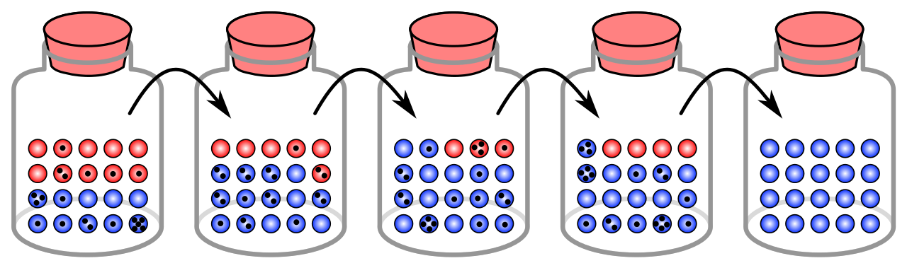
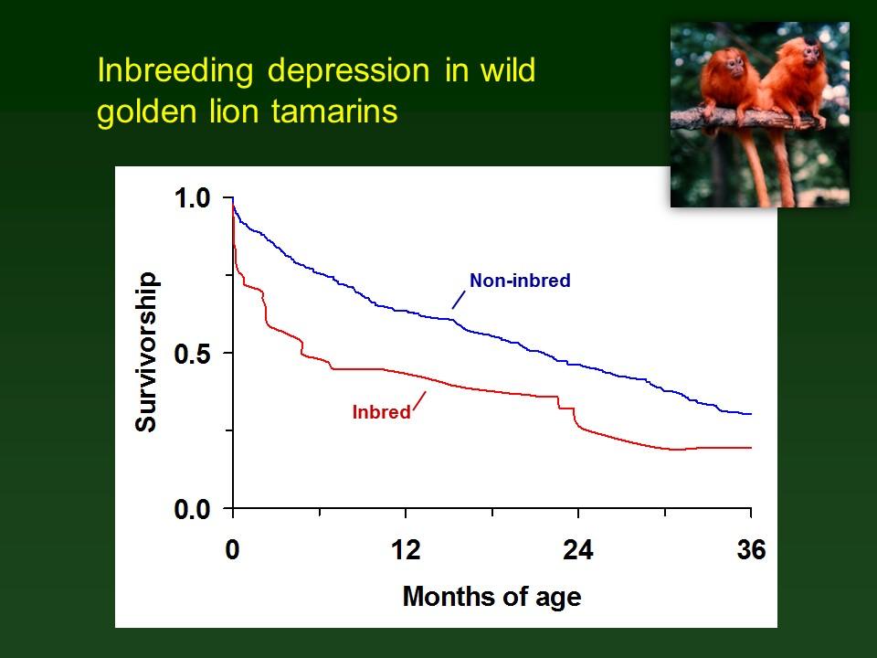
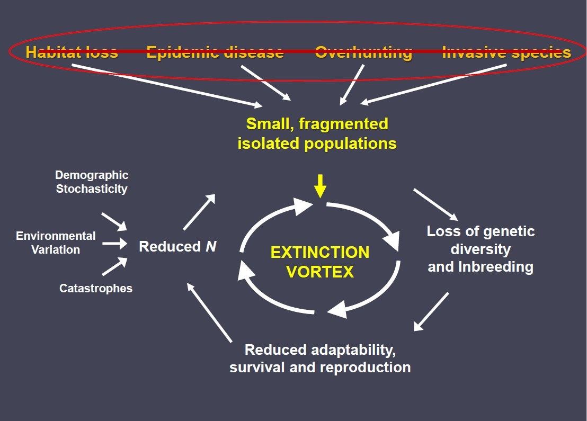
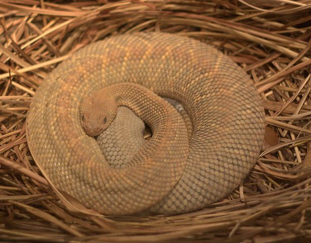
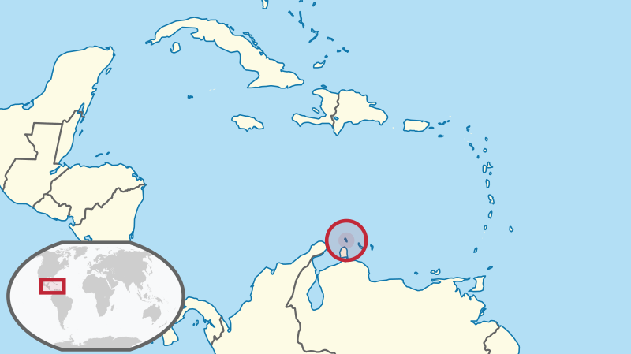

```{r setup, include=FALSE}
knitr::opts_chunk$set(echo = TRUE, cache = TRUE)
```


The final extinction of a population is usually caused by factors that small populations are uniquely sensitive to; once a population gets small enough, *demographic stochasticity*, *genetic drift*, and *inbreeding depression* can together deliver the 'final blow' to a population. 

In conservation biology the study of the drivers of extinction for small populations is called the *small-population paradigm*. The small-population paradigm refers to the tendency in **conservation biology** to study those largely *stochastic* factors that can result in the extinction or degradation of small populations. 

### Demographic stochasticity

We have already explored this concept, which is central to the small population paradigm! 

The simple fact is: _it is much more likely for all 10 individuals in a population to be **unlucky** in a given year than for all 1000 individuals in a population to be **unlucky** in a given year!!_ -- just as it is very unlikely for all coin flips out of 1000 to come up heads...

This illustrates the very important concept, that small populations can go extinct due to demographic stochasticity alone, whereas this possibility is vanishingly small for large populations. 

The moral of the story is: weird and dramatic things (e.g., extinction) can happen in small populations for no other reason than that the population is small!

Dramatic events like random extinction just would **never happen** in large populations due to random mating, birth, and mortality processes (assuming a stable, favorable environment and no range-wide catastrophic events)!

### Genetic drift

Same goes for *genetic drift*! Severe or consequential random fluctuations in a population's gene pool (genetic drift) is a _small-population phenomenon_!

In large populations, random forces are just not strong enough to eradicate a relatively common gene variant (allele) from a population (this could happen by natural selection, but not through random reproductive processes). 

In small populations, random chance can be the *primary driver* of genetic change over time! 

{width=75%}

Let's imagine that the balls in the jars in the above figure are individuals. The black dots indicate how many offspring each individual will have (thereby passing on its genes). The different colored balls represent different genetic variants. Each jar, left to right, represents a different (non-overlapping) generation. 

Does this sound familiar? Just by random chance, some individuals will breed and some will not. Just by random chance, some individuals will have more of their offspring survive. Genetic drift is simply a consequence of **demographic stochasticity**. 

Finally, let's imagine that the red balls represent individuals that are more resilient to drought (but have no selective advantage or disadvantage under normal circumstances). Just by random chance, the blue individuals happen to successfully mate and reproduce more than the red individuals- the blue variant becomes **fixed** in the population and the red variants go extinct. *There is no natural selection involved in this scenario -- just stochasticity!*

And now, by random chance, this population is now more susceptible to drought than it was before!

In a much larger population, the possibility of losing this drought-resistance allele from the gene pool due to random genetic drift would be vanishingly small. 

### Inbreeding depression

{width=50%}

Inbreeding depression is another problem peculiar to small populations.

Most diploid populations have some 'bad' gene variants (alleles) in their gene pool. These are often called **deleterious alleles**. These deleterious alleles usually don't cause problems because in general they are **recessive** - that is, the bad effect is only apparent if an individual has _two "bad" copies of that allele_! If these alleles are rare in the population, it is extremely unlikely that you get two copies of the same bad allele by chance!   

Unless... the two parents are close relatives (which can be more common in small populations). If parents are close relatives, both parents have a relatively high probability of inheriting at least one of the same 'bad' gene variants from a single common ancestor! 

If you consider that that single common ancestor likely had *lots* of deleterious recessive alleles embedded in their genome, then the chance of an inbred offspring inheriting two copies of that allele for at least one of those loci becomes fairly high! 

## Extinction vortex

{width=50%}

One of the important ideas emerging from the small population paradigm is the concept of the **extinction vortex**. This concept is illustrated in the above figure.

Once a population gets small enough, it becomes subject to catastrophic declines due to demographic (and environmental) stochasticity, leading to inbreeding and random loss of useful genes, leading to reduced vital rates, leading to smaller population sizes, leading to further genetic degradation, leading to greater influence of demographic stochasticity, leading ultimately to extinction...

Furthermore, once a population falls into the extinction vortex, it can't necessarily be saved by removing the factors that caused the population to become small in the first place. That is, once genetic drift has removed important adaptive variation from the gene pool, and once inbreeding has caused deleterious recessive alleles to start expressing more frequently, the population may not be able to be recovered effectively.  

Case study: florida panther genetic rescue.

In general, extinction is often caused by stochastic processes, but stochastic factors are unlikely to be the reason the population got small in the first place! (that is the topic of the 'declining population paradigm' lecture!)

## Minimum Viable Populations (MVP)

As wildlife managers, we often wish to know: "how small does a population have to be before we have to start worrying about adverse consequences like extinction, genetic erosion, and inbreeding?"

The most satisfying general definition of MVP (in my opinion) directly relates to the extinction vortex concept: Minimum Viable Population size (MVP) is that *population size below which the population becomes vulnerable to the extinction vortex* (or alternatively, the abundance threshold above which the extinction vortex can be safely avoided!). 

However, the above definition is not strictly quantifiable for most species. Also MVP is often defined in relation to population models, many of which don't have an explicit genetic component (because we often don't know exactly how many deleterious recessive alleles are in a population!). The quantitative, operational definition that we will use in this course is:

> MVP: the abundance threshold below which extinction risk exceeds [a risk tolerance threshold] over [a time horizon] 

To quantify MVP, we need to specify: (1) a time horizon (e.g., 50 years) and (2) a risk tolerance threshold (e.g., 5% extinction risk).

For example:

> MVP: the abundance threshold below which extinction risk exceeds 5% over 50 years

## Population Viability Analysis (PVA)

Population Viability Analysis (PVA) is often used to model the processes involved in the extinction vortex (the central concept of the small population paradigm). This can include genetic drift and inbreeding depression. However, in this course, we won't get into modeling genetics (unless you really want to- I'm happy to show you how to do this using the Vortex software!)

The most widely-used PVA software, [Vortex](https://www.cpsg.org/our-approach/science-based-tools/vortex), gets its name from the extinction vortex concept. Vortex does allow explicit modeling of inbreeding and loss of genetic diversity in small populations.  

{width=50%}


## Example: Aruba island rattlesnake

The Aruba Island Rattlesnake, or Cascabel (*Crotalus durissus unicolor*), is the top predator on the island of Aruba, and primarily consumes rodents. 

{width=50%}

The Aruba island rattlesnake, as you might expect, occurs only on the island of Aruba.

{width=50%}

The Aruba rattlesnake was listed as *Critically Endangered* by IUCN (it is no longer listed as of 2021 due to lack of information), and has several attributes that make it particularly susceptible to falling into the extinction vortex:

See [Lab 5](LAB5.html) for the related MVP activity.  


**Q** Why are island-endemic species like the Aruba rattlesnake so vulnerable to extinction? [PointSolutions]

**Q** Are species that are confined to small areas (like the Aruba rattlesnake) more vulnerable to *environmental stochasticity* than species that occupy larger geographic ranges? [PointSolutions]


[--go to next lecture--](LECTURE11.html)


