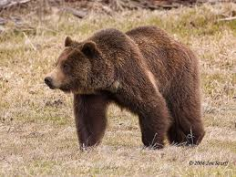
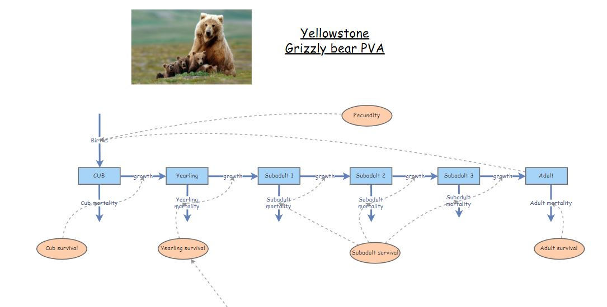
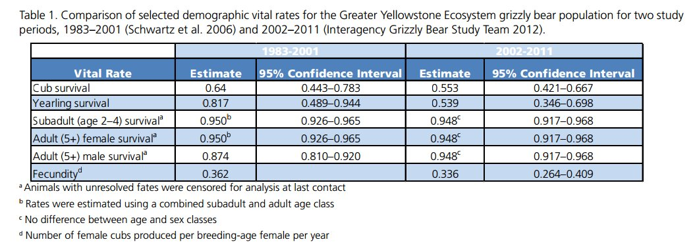
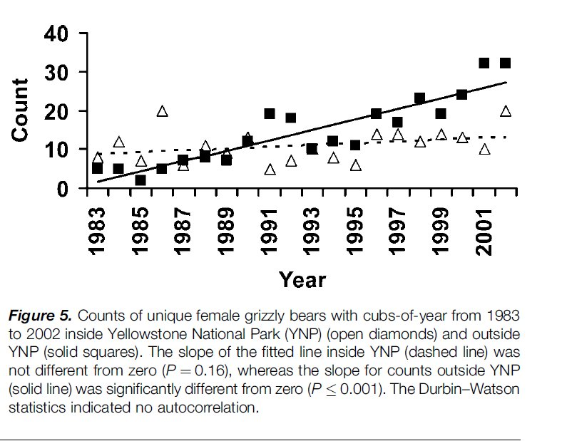

```{r setup, include=FALSE}
knitr::opts_chunk$set(echo = TRUE, cache = TRUE)
```


## PVA for Yellowstone grizzly bears!

In today's class we will use a PVA to do some management-relevant **scenario testing** for the grizzly bear population in Yellowstone National Park.



Our goal is to better understand the future of the grizzly bear population in Yellowstone park, and the processes that may regulate this population!

Let's walk together through the basic steps in building and running a PVA model: 

#### Step 1: life history diagram

Based on the literature that we have read, we determine that there are four main stages in the grizzly bear life history: cub, yearling, subadult and adult! The adult stage is the only one that is reproductive!

Therefore, our conceptual life history diagram looks something like this!



You can "clone" the base grizzly bear model [here](https://insightmaker.com/insight/162303/Yellowstone-Grizzlies-Unparameterized). This model has not yet been parameterized!

#### Step 2: parameterize!

Let's use this table to parameterize the population vital rates in our model!

This table actually has *two alternative parameterizations*, one summarized from data collected the period from 1983 through 2001, and the other representing data from the period from 2002-2011. 

NOTE: we are not paying any attention to males! Population models are often *female-only*, since females are usually the primary drivers of population dynamics.



The table is from [this scientific report](YellowstoneScience-BearIssue.pdf) ([alternative link](https://www.nps.gov/yell/learn/upload/YellowstoneScience-BearIssue.pdf))

What about population size? 

From [Schwartz et al 2006](schwarz_grizzly1.pdf) we know that:

1. Adult (reproductive) females represent approximately a half (50%) of the total female population. 
2. Total abundance of adult females in the greater Yellowstone park area (solid squares plus the open triangles) was ca. 10 in 1983 and ca. 40 in 2001/2002 



Let's use the initial (1983) abundances (all female!) to initialize our model:

*Cubs:* 3          
*Yearlings:* 3          
*Subadult 1:* 2           
*Subadult 2:* 2          
*Subadult 3:* 2          
*Adults:* 10           

Take a few minutes to parameterize the model, using the 1983 to 2001 estimates!

#### Step 3: Spatial structure (not applicable here)

#### Step 4: Simulate!

Okay, let's run the model!

1. Try running the model with the parameterization we discussed above. What do you notice? Is the population growing?

*REALITY CHECK*:       

**Q**: Given that the population of adult females is known to have increased to around 40 individuals by the year 2002, is this model realistic??      

2. What if we configure the model to run for 100 years? What happens now?

**Q**: *NOW* do you think this model is biologically realistic? Why or why not?

3. Now let's change the parameterization to reflect the vital rates observed for the period 2002 to 2011 in the table:


In 2002 the population was more like 40 females- so let's use the following initialization!

*Cubs:* 15      
*Yearlings:* 15       
*Subadult 1:*  5      
*Subadult 2:*  5        
*Subadult 3:*  5        
*Adults:* 40        

**Q**: What do you notice about this model? Is the population still growing? What about the overall *rate of growth* of the population?

**Q**: Which vital rates changed the most from 1983 to 2002? 

**Q**: Can you think of any reason for this change?

##### Density-dependence

4. Let's implement a new process into our model- **density-dependence**!

We know that when the total (female) population size was around 20, yearling survival was around 82%

We also know that when the total (female) population size was around 80, yearling survival dropped to around 54%

What is the **linear relationship** between population size and yearling survival? When abundance increased by 60, yearling survival rate decreased from 82% to 54% -- a 28% drop! 

**SLOPE**: For each additional individual in the adult population, yearling survival decreased by 0.47% ($=\frac{0.28}{60}$).

**INTERCEPT**: This can be interpreted as the expected yearling survival when there are no adults in the population. When there were 10 female adults, yearling survival was 81.7%. If there were 0 individuals in the adult population, yearling survival would (theoretically) be $81.7 + 0.47\cdot 10$, which is 86.4%. 

So the linear formula for computing yearling survival as a function of adult female abundance should be:

$Surv_{yearling} = \frac{\left (  86.4 - 0.47*N_{female} \right )}{100}$

NOTE: we divide by 100 to convert the result from a percentage to a fraction

Let's implement this *density-dependent process* in Insightmaker!

- First, load [this InsightMaker model](https://insightmaker.com/insight/162306/Yellowstone-Grizzlies-densdep-noequation). Clone it so you can make edits!

- Open the *equation editor* for yearling survival, and input the equation above! Let's do it together!  

Run the model! What do you notice?

Try running the model for 100 years. 

**Q**: Why is this type of model called **density-dependent**?


### Grizzly bear in-class exercises

Working in groups is encouraged!!

To start off, you can clone a full, density-dependent version of the grizzly model [here](https://insightmaker.com/insight/162305/Yellowstone-Grizzlies-densdep)

1. Make sure the initial abundances are set at the estimated values for 1983 to 2001, and the model is set to run for 100 years.    

2. "Comment out" the density dependence equation in the equation editor for yearling survival (place a pound sign before the equation; see below for more explanation). Instead, use the yearling survival estimate for the 2002-2011 time period (0.539). The "commenting out" trick enables you to easily run the grizzly bear PVA with and without the density-dependence process (using the pound signs to alternately comment out the density-dependence equation or the value '0.539'; see below). 


**Please write down your responses to the following questions:**:

**Question 2.1** What is the approximate **carrying capacity** (K) of the Yellowstone grizzly population? NOTE: this is an **emergent property** of our new, density-dependent model! We didn't specify carrying capacity, but it *emerges* out of the model.

**Question 2.2** In each case (with density-dependence and without density-dependence; i.e., yearling survival = 0.539), what is the approximate 90% confidence interval for the total population abundance after 100 years? (hint: use the 'Sensitivity Testing' tool; see below for more details) 

Before answering the next question, comment out the density-dependence equation and set yearling survival to its lowest possible value from Table 1 (above; 0.346). This is an example of a **worst-case scenario** 

**Question 2.3** Local managers have decided that a viable grizzly bear population should have no more than a 5% risk of falling below 30 total individuals at any time over the next 100 years, can you identify an approximate **minimum viable population size (MVP)** for this population under the worst-case scenario above? That is, try to find a set of initial abundances (initial abundance for each of the 6 age-classes) such that you can't reduce the population any further without having an unacceptable (>5%) risk of falling below 30 individuals over the next 100 years.


#### Helpful hints to answer the grizzly bear questions

##### "commenting out" the density-dependence equation

You can turn the density dependence process on and off by using the pound symbol to "comment out" the equation. So ... if you input the following into the equation editor for yearling survival, you can easily go back and forth between the density-dependent and the density-independent formulations of the model:

For example, this one is density-independent:

```
0.539
#0.864-0.004666*[Total abundance]
```

...and this one is density-dependent:

```
#0.539
0.864-0.004666*[Total abundance]
```

...or for the worst case scenario:

```
#0.539
#0.864-0.004666*[Total abundance]
0.346
```


##### using the sensitivity testing tool to evaluate risk

Use the "sensitivity testing" option in the "Tools" menu to run multiple simulations. You can visually assess the risk of falling below a certain abundance threshold by examining whether a particular quantile (e.g., 90%) of your simulation results (the output from the sensitivity testing tool) falls below a particular threshold (e.g., 1 individuals) over a specified number of years (e.g., 50 year). For example, the following figure illustrates a population with an extinction risk of approximately 5% (90% of the simulations fall within the blue region, so 5% of simulations fell below the threshold and the remaining 5% of of simulations were larger than the upper bound of the blue region) :


You can compute the risk of extinction or decline more quantitatively as the fraction of replicates that failed to meet the specified criterion. That is, you can divide the total number of simulations falling below the threshold by the total number of replicates.


[--go to loggerhead PVA--](PVA3_421.html)


